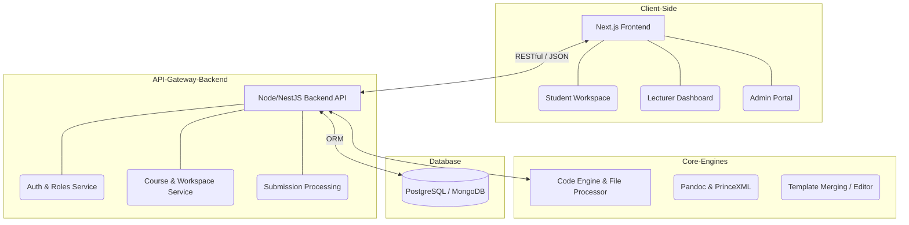
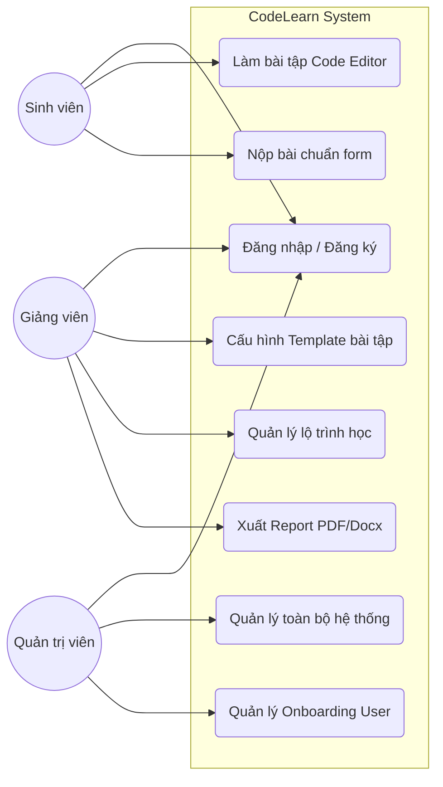
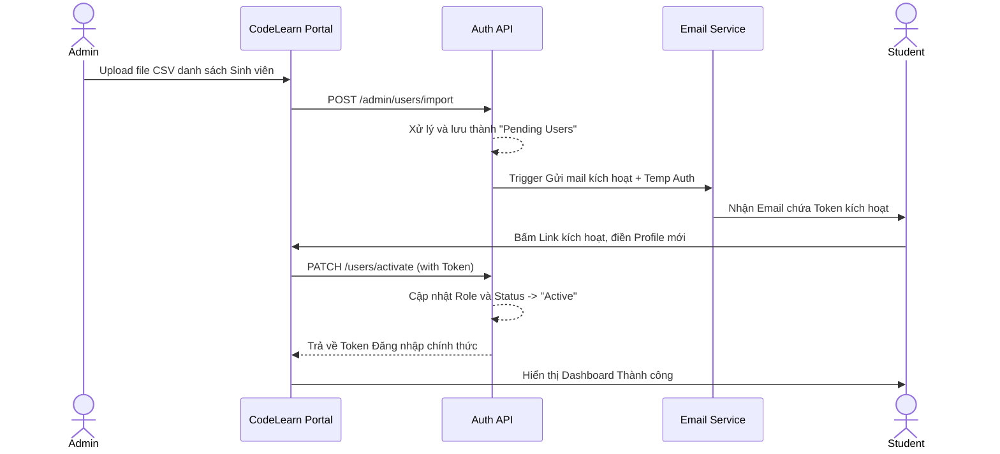
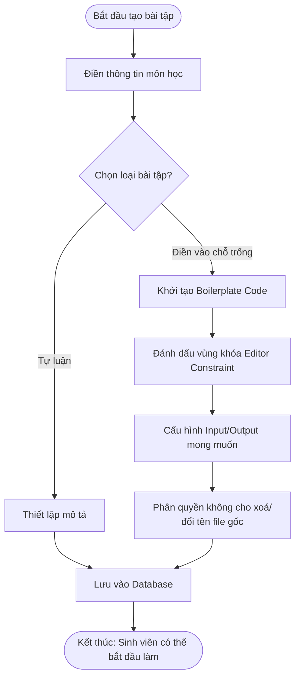
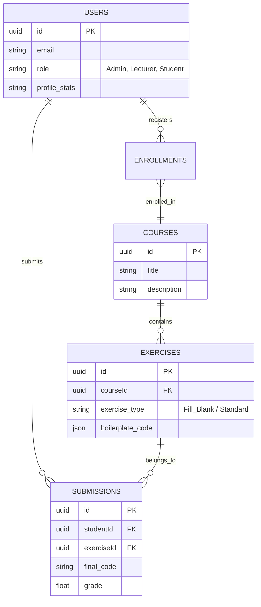

# DANH SÁCH MÃ CODE TẠO SƠ ĐỒ (MERMAID LAB)
*Hướng dẫn sử dụng: Bạn hãy copy từng khối mã (bắt đầu sau \`\`\`mermaid) bỏ vào trang web [https://mermaid.live/](https://mermaid.live/) để xuất ra hình ảnh chất lượng cao PNG/SVG và dán vào các phần chú thích trong Báo cáo.*

---

## 1. Sơ đồ Kiến trúc Hệ thống Tổng thể (Gắn vào mục 2.2)

---

## 2. Biểu đồ Use-case Tổng quát (Gắn vào mục 3.1)

---

## 3. Biểu đồ Tuần tự quá trình Onboarding Sinh viên (Gắn vào mục 3.2 - Nhóm 1)

---

## 4. Dòng chảy Tạo bài tập Điền vào chỗ trống (Gắn vào mục 3.2 - Nhóm 2)

---

## 5. Cấu trúc Database ERD hạt nhân (Gắn vào mục 3.3)

