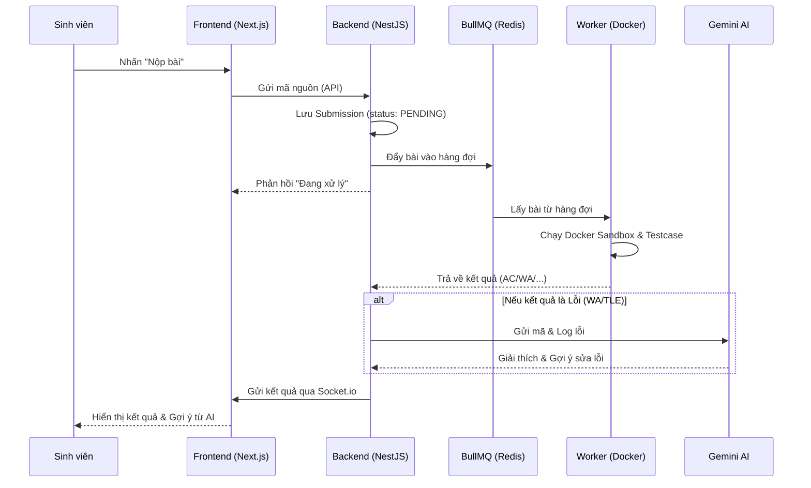
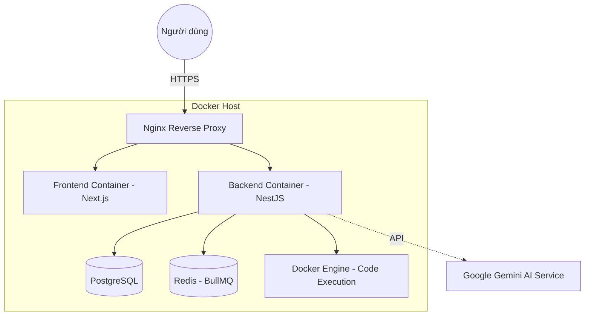

# MÃ NGUỒN VẼ SƠ ĐỒ CHƯƠNG 3

Dưới đây là các mã nguồn để bạn copy vào các trình soạn thảo trực tuyến để lấy file ảnh cho báo cáo.

## 1. Sơ đồ Use Case (General)
**Trang web hỗ trợ:** [Mermaid Live Editor](https://mermaid.live/)

```mermaid
useCaseDiagram
    actor "Sinh viên" as Student
    actor "Giảng viên" as Lecturer
    actor "Quản trị viên" as Admin

    package "Hệ thống CodeLearn" {
        usecase "Đăng nhập Google OAuth" as UC1
        usecase "Làm bài tập & Nộp bài" as UC2
        usecase "Hỏi đáp với AI Gemini" as UC3
        usecase "Xem bảng xếp hạng & Lịch sử" as UC4
        
        usecase "Quản lý Khóa học & Bài tập" as UC5
        usecase "Kiểm tra đạo văn" as UC6
        usecase "Xem báo cáo Analytics" as UC7
        
        usecase "Quản lý người dùng & Hệ thống" as UC8
    }

    Student --> UC1
    Student --> UC2
    Student --> UC3
    Student --> UC4

    Lecturer --> UC1
    Lecturer --> UC5
    Lecturer --> UC6
    Lecturer --> UC7

    Admin --> UC1
    Admin --> UC8
```

## 2. Sơ đồ Thực thể Mối quan hệ (ERD)
**Trang web hỗ trợ:** [dbdiagram.io](https://dbdiagram.io/)

```dbml
// Sơ đồ Database CodeLearn - PostgreSQL
Table users {
  id uuid [pk]
  full_name varchar
  email varchar [unique]
  mssv varchar
  role role_enum
  rating int
  xp int
  created_at timestamp
}

Table courses {
  id uuid [pk]
  name varchar
  code varchar
  lecturer_id uuid [ref: > users.id]
  semester varchar
}

Table problems {
  id uuid [pk]
  title varchar
  slug varchar [unique]
  difficulty varchar
  created_by uuid [ref: > users.id]
  course_id uuid [ref: > courses.id]
}

Table submissions {
  id varchar [pk]
  user_id uuid [ref: > users.id]
  problem_id uuid [ref: > problems.id]
  code text
  status varchar
  score int
  runtime float
  memory float
  created_at timestamp
}

Table testcases {
  id uuid [pk]
  problem_id uuid [ref: > problems.id]
  input text
  expected_output text
  is_sample boolean
}
```

## 3. Sơ đồ Tuần tự (Sequence Diagram) - Luồng Nộp bài & AI
**Trang web hỗ trợ:** [Mermaid Live Editor](https://mermaid.live/)



## 4. Sơ đồ Triển khai (Deployment Diagram)
**Trang web hỗ trợ:** [Mermaid Live Editor](https://mermaid.live/)


