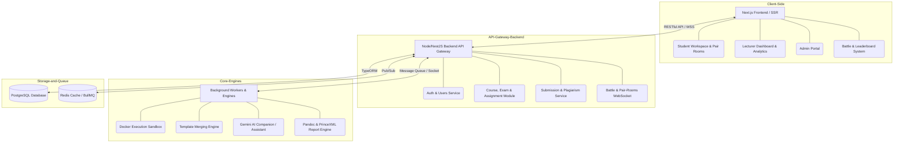

# CHƯƠNG 2. THIẾT KẾ KIẾN TRÚC VÀ QUYẾT ĐỊNH CÔNG NGHỆ LÕI

Chương này đi sâu vào việc giải phẫu các lý do đằng sau việc lựa chọn các nền tảng công nghệ (Technology Stack) cụ thể và cách thức các thành phần này được cấu trúc, kết nối để giải quyết các bài toán về hiệu suất, bảo vệ tính toàn vẹn của mã nguồn, và đảm bảo sự mạch lạc trong chu trình tương tác thời gian thực của nền tảng CodeLearn.

### 2.1. Bộ tiêu chí đánh giá và lựa chọn công nghệ định hướng hiệu năng
Để đáp ứng khối lượng tải công việc khắc nghiệt của một hệ thống EdTech có tính tương tác cực kỳ cao (ví dụ: trình biên tập Code tương tác thời gian thực, bộ biên dịch tài liệu, đánh giá mã qua test cases), công nghệ nền tảng không chỉ cần giải quyết ổn thỏa nhu cầu vận hành hiện tại mà còn phải đặc biệt chú trọng đến tính co giãn tự động (Scalability). Các tiêu chí cốt lõi định hình kiến trúc bao gồm:

1. **Khả năng chiết xuất và kết xuất hỗn hợp (Server-Side Rendering & Client interaction):** Phải tối ưu hóa tốc độ tải trang ban đầu (First Contentful Paint) cho các bài giảng có dung lượng lớn, đồng thời giảm thiểu độ trễ thao tác của sinh viên trên trình duyệt. Việc cân bằng giữa SSR và CSR là bài toán sống còn.
2. **Khả năng tích hợp sâu luồng I/O (Input/Output stream processing):** Do tính chất hệ thống phải xử lý lượng lớn tiến trình đọc, ghi và convert file liên tục trong bộ nhớ đệm (ví dụ biến đổi Markdown sang cấu trúc Code, lưu tạm snapshot code), hệ thống Backend phải xử lý bất đồng bộ (Asynchronous) mà không gây chặn luống (blocking thread) luồng xử lý truy vấn API chính của người dùng khác.
3. **Quản lý không gian trạng thái (State Management) phức hợp siêu nhạy:** Giao diện Workspace của sinh viên yêu cầu sự đồng bộ tinh vi giữa Cây thư mục (File Explorer) và Khung gõ mã (Code Editor) theo từng chu kỳ miligiây. Điều này khắt khe đòi hỏi một thư viện UI có kiến trúc quản lý trạng thái luồng đơn (Uni-directional data flow) mạnh mẽ và độc lập.

Với những phân tích khắt khe trên, dự án đã chọn hệ sinh thái **React / Next.js (App Router)** cho phía Frontend để tận dụng tối đa lợi thế Hydration, kết hợp hệ thống **Node.js (NestJS)** cho Backend để đảm bảo năng lực chịu tải I/O xuất sắc.

### 2.2. Thiết kế Kiến trúc Hệ thống Tổng thể đa phân hệ
Cấu trúc tổng thể của CodeLearn được hiện thực hóa theo mô hình Client-Server Architecture có định hướng Micro-services một phần, phân tách tường minh trách nhiệm của từng node nhằm dễ dàng khoanh vùng lỗi, bảo trì và tích hợp (CI/CD) trong tương lai.

**Kiến trúc được chia làm 4 phân hệ (Subsystems) cốt lõi:**

- **Client-Side (Trình bày giao diện trực diện):** Tầng này đảm nhận việc bao bọc trải nghiệm người dùng cuối qua luồng Student Workspace (Khu vực gõ code an toàn), Lecturer Dashboard (Nơi phân tích, thống kê trực quan) và Admin Portal (Quản lý User Complex đa chiều). Nó chịu trách nhiệm lọc và xử lý ban đầu hàng ngàn sự kiện DOM (chuột, bàn phím gõ code) trước khi đóng gói gửi về máy chủ.
- **API-Gateway & Core Backend (Điều phối trung tâm):** Đóng vai trò là cầu nối giao tiếp bảo mật thông qua chuẩn RESTful API. Hệ thống thực hiện việc kiểm tra danh tính (JWT Auth Validation), phân quyền Role (RBAC), điều hướng thao tác cơ sở dữ liệu (ORM wrapper), và đặc biệt là ghi nhận khởi tạo tiến độ nộp bài (Submission Tracking).
- **Core-Engines (Trái tim kỹ thuật chịu tải cục bộ):** Đây là phân hệ độc quyền thực hiện các nhiệm vụ "nặng" nhất, bao gồm Engine Dịch tài liệu (Document Processor Engine) biến đổi mã nguồn/Markdown thành PDF báo cáo, và Engine Trộn/Giấu mã (Template Merging Engine) chuyên đóng gói mã của sinh viên với file cài đặt gốc của giáo viên.
- **Database & Queue (Tầng Lưu trữ và Đệm):** Tầng cấu trúc quan hệ phức tạp PostgreSQL quản lý thực thể Khóa học, Bài làm, trong khi Redis + BullMQ đóng vai trò làm hàng đợi (Queue) bảo vệ hệ thống chấm code khỏi bão hòa khi có lệnh DDoS hoặc thi đồng loạt.

### 2.3. Giải pháp Xử lý Dữ liệu và Kiểm soát Bảo mật ứng dụng (State & Security Constraints)

**a. Cơ chế Quản lý Không gian Trạng thái (State Management) và Lỗi Theme Injection**
Trong quá trình hiện thực, một thách thức kỹ thuật lớn đã nảy sinh ở Frontend là hiện tượng *Hydration Mismatch* (Bất đồng bộ giao diện HTML giữa Server render lần đầu và Client takeover) khi tích hợp Theme Provider động (Light/Dark mode) cùng các Component nặng như Code Editor.
* -> **Giải quyết thuật toán:** Thay vì đẩy state trực tiếp lên Component cha (gây re-render toàn cục), hệ thống áp dụng kỹ thuật *pure rendering functions* cho layer bọc Theme. Trì hoãn việc load các Javascript module phục vụ Code Editor cho tới sau khi vòng đời `useEffect` đầu tiên (chạy phía Client) kết thúc. Kỹ thuật "Lazy initialization" này giúp loại bỏ hoàn toàn các cảnh báo lỗi chớp tắt màn hình của Next.js khi chuyển mode ngày/đêm.

**b. Phân quyền và Bảo vệ tuyến (Role-Based Access Control - RBAC) chuyên sâu**
An ninh hệ thống API được thiết lập cực kỳ nghiêm ngặt do chứa dữ liệu điểm số và thông tin cá nhân sinh viên.
* -> **Cơ chế kỹ thuật:** JWT payload không chỉ chứa UID mà gắn kết mật thiết với mã Hash phân mảnh vai trò. Mọi đường dẫn bắt đầu bằng `/admin/...` đều trải qua Middleware kép chặn luồng sinh viên. Khi xử lý cập nhật dữ liệu định danh phức hợp (Trường đại học, Số điện thoại), hệ thống bắt buộc sử dụng cơ chế PATCH cục bộ, thay vì Overwrite toàn bộ JSON để tránh các Payload Injection ngầm làm phá hoại dữ liệu ẩn của profile.

### 2.4. Core Engines: Tích hợp Hệ công cụ lõi chuyên biệt làm nên sự khác biệt
Điểm nhấn tạo nên sự nguyên bản có giá trị nghiên cứu cao của dự án CodeLearn so với các website thực hành thương mại thông thường nằm ở hai bộ Engine kỹ thuật cao tự tinh chỉnh:

**a. Động cơ sản xuất báo cáo chuẩn hàn lâm (Pandoc & PrinceXML Generation Engine)**
Môi trường đại học yêu cầu lưu trữ báo cáo định dạng File Cứng (PDF) để phục vụ kiểm định chất lượng hoặc chấm chéo. Các thư viện JS nội bộ render PDF trên web hiện nay (jsPDF, Puppeteer/Headless Chrome) thường thất bại hoặc xuất ra kết quả vỡ layout đối với Code Blocks dài hoặc table phức tạp.
* -> **Nguyên lý thiết kế Engine:** Hệ thống sử dụng tổ hợp Pipeline tiêu chuẩn quốc tế:
    1. **Pandoc CLI** đóng vai trò là Parser, dịch các chuỗi tài liệu văn bản kết hợp mã nguồn (Markdown / JSON trees) thành dạng HTML phân cấp chuẩn.
    2. HTML này được đẩy qua **PrinceXML Engine**, một công cụ render CSS cực mạnh dành riêng cho in ấn vật lý. PrinceXML có khả năng xử lý Paged Media CSS (điều khiển `@page` rule), kết nối đúng thư viện fonts tiếng Việt nội bộ (tránh lỗi ô vuông), đánh dấu số trang và sinh Header/Footer tự động để tạo ra File PDF đạt tiêu chuẩn in ấn nhà trường trước khi Stream gửi trả cho trình duyệt tải về.

**b. Kỹ thuật ảo hóa bảo vệ bài tập "Điền vào chỗ trống" (Boilerplate / Editor Constraint Engine)**
Để phục vụ yêu cầu tạo các bài tập định hướng giải thuật mà sinh viên chỉ được quyền chỉnh sửa một đoạn ruột, bị cấm xóa template, hệ thống thực thi cơ chế **Locking Range** ngay tại tầng logic không gian làm việc.
* -> **Nguyên lý thiết kế Engine:**
    Hệ thống hoàn toàn "không tin tưởng" Client. Thay vì gửi source gốc về máy sinh viên, Backend cấp phát một JSON Metadata vạch rõ toạ độ (`Read-only chunks` theo Line/Column). Trình biên tập (Monaco Editor UI) sẽ dựa vào Metadata này đánh dấu các khu vực giao diện "Cấm sửa", chặn các tổ hợp phím (Ví dụ Cut, Delete) và gỡ bỏ chức năng Đổi tên file (Rename file). 
    *Quan trọng hơn:* Khi nộp bài (Submit), luồng Client chỉ có thể gửi lên những đoạn text nằm trong ranh giới cho phép. Backend tiếp nhận, tự động nội suy và *merge (trộn)* đoạn lệnh mỏng manh này lách vào trong file Template xịn đang giấu kín trên ổ cứng Server, sau đó mới đóng gói gửi vào hệ thống Sandbox cấp ảo để chạy Test Cases. Điều này ngăn chặn 100% rủi ro sinh viên viết mã độc sửa file Test.
