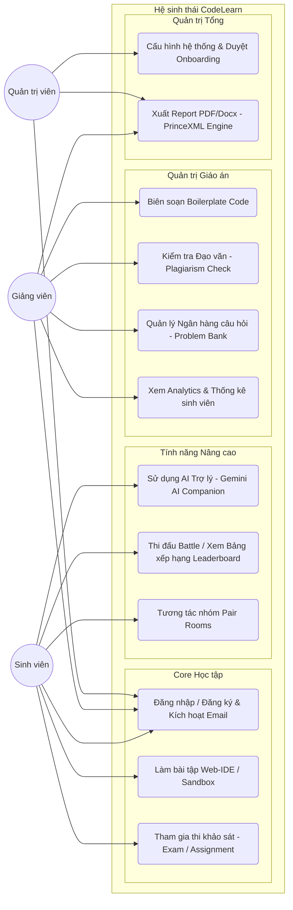
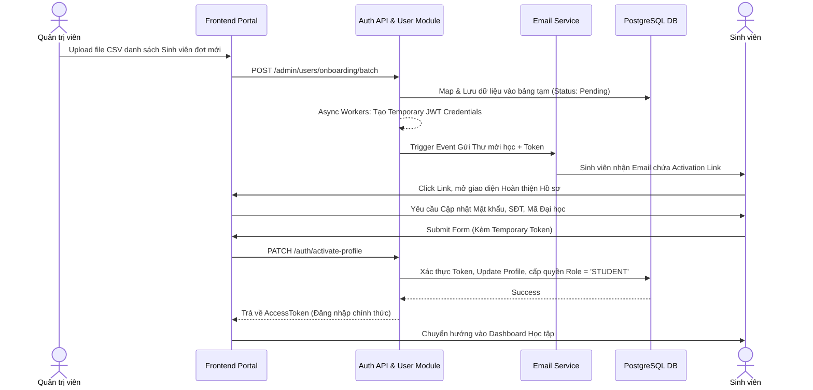
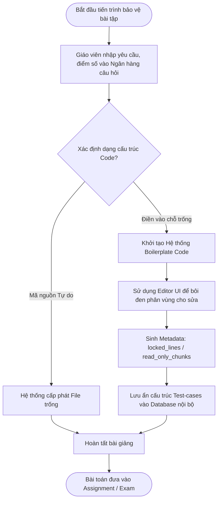
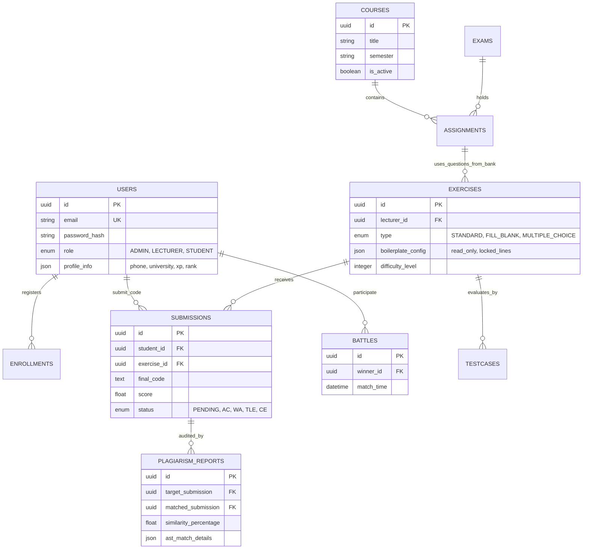

# CHƯƠNG 3. PHÂN TÍCH NGHIỆP VỤ VÀ THIẾT KẾ YÊU CẦU HỆ THỐNG

Chương này đi sâu vào việc giải phẫu các luồng nghiệp vụ (Business Logic) nhằm số hóa chính xác các tác vụ giảng dạy tại môi trường đại học vào nền tảng CodeLearn. Yêu cầu đặt ra không chỉ là một ứng dụng web CRUD (Create, Read, Update, Delete) thông thường, mà là một hệ thống xử lý logic rẽ nhánh, bảo vệ tính toàn vẹn trạng thái và phân quyền một cách cực kỳ sát sao đối với từng đối tượng sử dụng.

### 3.1. Định nghĩa các tác nhân và Kịch bản sử dụng hệ thống (Use-Case Analysis)

Hệ thống được thiết kế hoàn toàn dựa trên sự phân tần đặc quyền (Privilege separation) của 3 nhóm tác nhân (Actors) cốt lõi, đảm bảo sự bảo mật và không dẫm chân lên vai trò của nhau:

1. **Sinh viên (Student):**
    - *Đặc điểm:* Là đối tượng thụ hưởng chính, tham gia vào các khóa học đã được phân bổ định danh. 
    - *Nhiệm vụ trên hệ thống:* Sinh viên tương tác chủ yếu qua Workspace (môi trường gõ mã nội bộ). Họ thực thi bài code, nhận đánh giá tự động tức thời từ hệ thống (Passed/Failed), tra cứu lịch sử nộp bài (Submission History), đọc giải thích từ Trợ lý ảo Gemini AI, và tự tiến hành trích xuất báo cáo kết quả đánh giá (Export Report tới định dạng PDF).
2. **Giảng viên (Lecturer / Instructor):**
    - *Đặc điểm:* Là tác nhân xây dựng tri thức và điều phối lớp học. 
    - *Nhiệm vụ trên hệ thống:* Người trực tiếp tạo mới các khóa học (Courses), thiết lập thành phần "bộ xương" bài tập (Boilerplate) cho cấu trúc "Điền vào chỗ trống". Giảng viên quản lý các bài toán (Problems), cấu hình dữ liệu đầu vào chuẩn (Test-case inputs), và giám sát theo thời gian thực (Real-time Analytics) quá trình làm bài của sinh viên trên Dashboard thông minh để kịp thời điều chỉnh giáo án. Bên cạnh đó, thao tác quét kiểm tra Đạo văn (Plagiarism Check) cũng thuộc thẩm quyền nhóm này.
3. **Quản trị viên hệ thống (System Administrator):**
    - *Đặc điểm:* Là kỹ sư phần mềm hoặc chuyên viên Phòng Đào tạo, đóng vai trò Cầu nối kỹ thuật. 
    - *Nhiệm vụ trên hệ thống:* Giám sát trạng thái hoạt động của hệ thống phần cứng (Service Health check), nắm quyền cao nhất trong luồng quản lý người dùng (User Management). Họ chịu trách nhiệm khởi tạo tập hồ sơ người dùng lớn, cấu hình phân lớp Role RBAC (Student/Lecturer) và giải quyết các vấn đề sự cố tài khoản.

### 3.2. Thiết kế luồng nghiệp vụ cốt lõi (Core Business Flows)

Để giải quyết triệt để các "nỗi đau" (Pain points) đã nêu ở Phần 1, CodeLearn quy hoạch và pháp lý hóa hai nhóm luồng xử lý trọng tâm đặc biệt sau:

#### Nhóm 1: Tiến trình Đăng ký Sinh viên khép kín và An toàn (Closed Onboarding System)
Việc cho phép người dùng trên Internet tự do "Sign Up" thường dẫn đến lượng lớn dữ liệu rác. CodeLearn giải quyết bài toán định danh này theo tiêu chuẩn đại học bằng quy trình Onboarding xác thực vòng kín:
- **Bước 1 (Khởi tạo hàng loạt - Batch Import):** Quản trị viên (Admin) đẩy Upload danh sách sinh viên qua định dạng chuẩn file `.CSV` vào hệ thống. Các tài khoản này thay vì được Active ngay, sẽ được cơ sở dữ liệu (PostgreSQL) ghi nhận cẩn thận ở trạng thái chờ cấu hình (`Status: Pending Users`).
- **Bước 2 (Gửi Token Xác thực):** Hệ thống Event-Emitter tự động Trigger kích hoạt một tiến trình nền bất đồng bộ (Background job). Tiến trình này sinh ra các Mã bảo mật ngẫu nhiên mã hóa JWT (Temporary Credentials Token) có thời hạn 48 giờ và gửi qua giao thức SMTP đến hệ thống Email của từng sinh viên.
- **Bước 3 (Tiếp nhận và Định danh):** Sinh viên nhận email báo nhập học, bấm vào đường link chứa Query String kích hoạt. Tại đây, luồng Frontend chuyển hướng người dùng vào trang Profile Setup, yêu cầu sinh viên khai báo tính pháp lý (ví dụ: Ngày sinh, Chuyên ngành, Trường đại học, SĐT).
- **Bước 4 (Kích hoạt - Activate):** Khi Form được Submit, lời gọi API mang Payload cùng Token này được gửi về Backend. Node server giải mã Token, đối chiếu chữ ký (Signature), nếu mọi thứ an toàn nó tiến hành cập nhật Data, thay đổi trạng thái vòng đời tài khoản thành `Active` và cấp quyền đăng nhập chính thức.

#### Nhóm 2: Thuật toán quy hoạch bài tập "Điền vào chỗ trống" (Boilerplate Protection Workspace Flow)
Đây là quy trình độc quyền có hàm lượng sáng tạo cao nhất của CodeLearn, bảo vệ tính toàn vẹn của mã nguồn mẫu.
- **Bước 1 (Thiết lập ranh giới - Marking chunk):** Giảng viên tạo khung bài tập chuẩn (Boilerplate) trên UI. Bằng cách thao tác phủ khối trực quan, hệ thống thu thập tọa độ (Start-line, End-line) ghi ranh giới cho phép sinh viên tác động thành một Metadata JSON riêng biệt.
- **Bước 2 (Kiểm soát môi trường Client):** Khi Sinh viên mở Workspace để học, hệ thống API tiến hành khóa cứng (Read-only lock) lên toàn bộ các DOM thao tác File Tree. Biến thể UI (Monaco Editor Context) cấu hình lại, buộc sinh viên chỉ có thể chèn code vào các khối ranh giới (Editor boundaries). Mọi thao tác Ctrl+X, Delete ngoài lề đều bị Event Listener gạt bỏ.
- **Bước 3 (Đồng bộ lắp ghép An toàn - Server Secure Merge):** Trong quá trình nộp bài (Submit), để phòng ngừa sinh viên sử dụng Postman hay cURL giả mạo Request sửa đổi lõi, Payload API chỉ cho phép chứa phần Code thuộc block hợp lệ. Payload cục bộ gửi lên sẽ được chặn ở tầng Service Backend. Dữ liệu đoạn code rời rạc của sinh viên sẽ được dịch ngược về Server, sau đó Engine Merge tiến hành nội suy, trộn "khéo léo" vào khung Boilerplate vô hình giấu mặt tại tầng Backend. Đoạn mã "nguyên vẹn và không chứa mã độc sửa Test-case" này mới được đóng gói gửi vào Sandbox Docker để chấm điểm tự động.

### 3.3. Thiết kế Cấu trúc Cơ sở dữ liệu hạt nhân (Data Modeling - ERD)
Cấu trúc CSDL được hệ thống hóa chuẩn 3NF (Third Normal Form) để tránh dị thường dữ liệu (Data Anomalies) trong quá trình Scale-up đón nhận hàng vạn sinh viên, xử lý truy vấn chéo (JOIN operations) với tốc độ cao. Các thực thể (Entities) cốt lõi bao gồm:

1. **Thực thể USERS (Người dùng):** Chứa trường định dạng `id (UUID)`, `email (Unique)`, `hash_password`, và đặc biệt là phân loại quyền hạn `Role Enum`. Điểm lưu ý là dữ liệu hồ sơ chi tiết (Profile Info) được thiết kế nới lỏng để hỗ trợ các cập nhật rời rạc qua chuẩn PATCH.
2. **Thực thể COURSES & PROBLEMS (Học liệu và Bài toán):** Lưu giữ quan hệ logic phân nhánh. Bảng `Problems` lưu trữ thông tin hiển thị cơ bản, trong khi bảng `Exercises/Testcases` chứa các trường định dạng JSON mở rộng nhằm đặc tả cấu trúc tham số Boilerplate và thông số Input/Expected Output bảo mật.
3. **Thực thể SUBMISSIONS (Giao dịch nộp bài):** Đóng vai trò là trung tâm Audit (Log hệ thống). Bảng này lưu trữ `id`, `user_id_fk`, `problem_id_fk`, `status`, `score`. Điều tối quan trọng là bảng luôn bảo lưu nguyên si mã nguồn nộp tại thời điểm đó (`final_code snapshot`) nhằm mục đích tra soát lịch sử của sinh viên nếu xảy ra khiếu nại điểm số, cũng như phục vụ thuật toán dò tìm Đạo văn (Plagiarism Check) chéo giữa các dòng record.
4. **Thực thể ENROLLMENTS (Ghi danh):** Bảng xử lý định hình quan hệ mạng lưới đa chiều (Many-to-Many), liên kết Môn học giảng viên quản lý tương ứng với từng tập hợp sinh viên một cách linh hoạt, hỗ trợ trạng thái bảo lưu, hoãn đóng học phí.

### 3.4. Kiến trúc luồng Thực thi ảo hóa (Sandbox Submission Workflow)
Nhằm bảo vệ hệ thống trước sự cố nghẽn mạng cục bộ, quy trình chấm bài code của sinh viên được thiết kế theo cơ chế Pub/Sub hoàn toàn bất đồng bộ (Asynchronous Design):
1. **Tiếp nhận API / Hàng đợi (Queue Buffering):** Web server tiếp nhận mã nguồn, nhưng tuyệt đối không chạy lệnh ngay. Mã nguồn và bài toán được đóng gói, dán nhãn Job và đẩy vào **Redis Queue** để bảo đảm hàng đợi FIFO ổn định nhờ Engine **BullMQ**.
2. **Worker xử lý biệt lập (Isolated Sandboxing):** Nhóm máy chủ nhận nhiệm vụ (Worker Nodes) tiến hành Consume job từ hàng đợi. Nó khởi tạo một container **Docker** ngắn hạn cách ly tài nguyên (CPU, RAM). Bên trong rào cản này, code sinh viên được biên dịch, truyền Input thông qua Pipe và xuất ra Log đầu ra trong giới hạn 2 giây (Time Limits).
3. **Phản hồi thời gian thực qua WebSockets:** Kết quả Test-case xuất về được ghi thẳng vào Database và phát sự kiện Broadcast thông qua **Socket.io**. Phía giao diện của sinh viên sẽ tự bắt event đổi trạng thái sang hiệu ứng Màu xanh (Passed) hay Đỏ (Compiler Error) ngay lập tức mà không cần F5 trình duyệt. Đồng thời, API phụ được kích hoạt để hỏi Gemini AI nhằm giải thích chi tiết lỗi để đút kết thành log phản hồi cho sinh viên.
