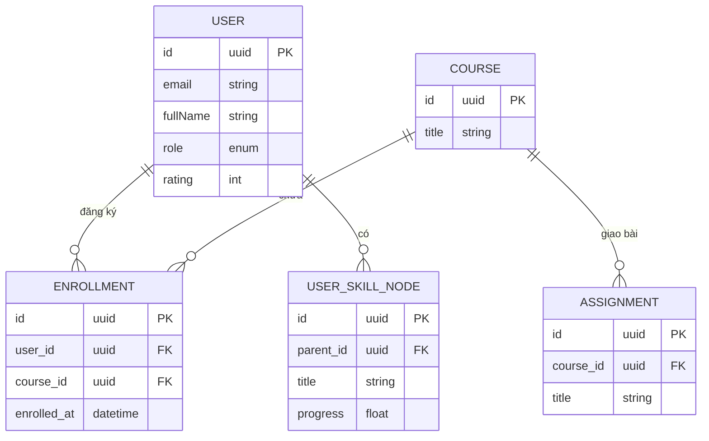
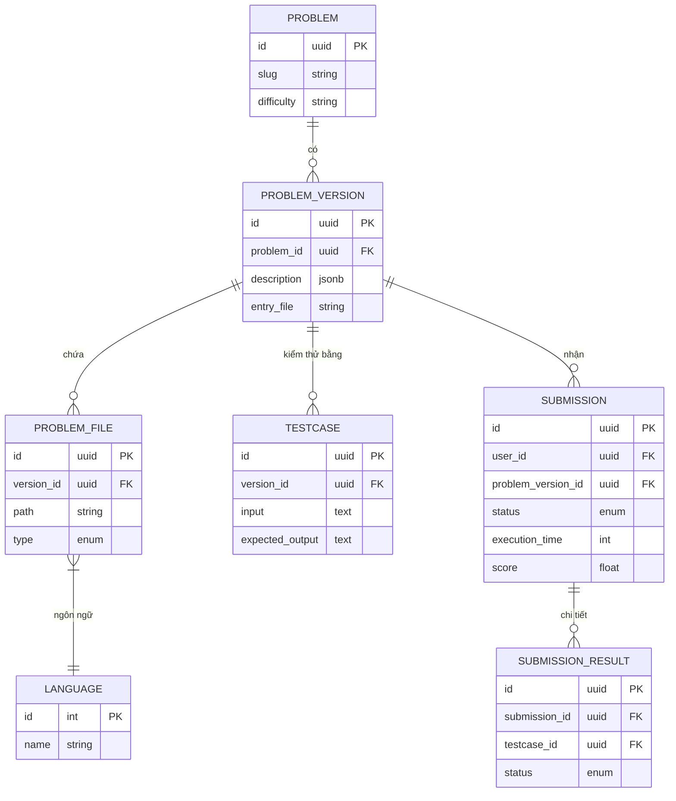
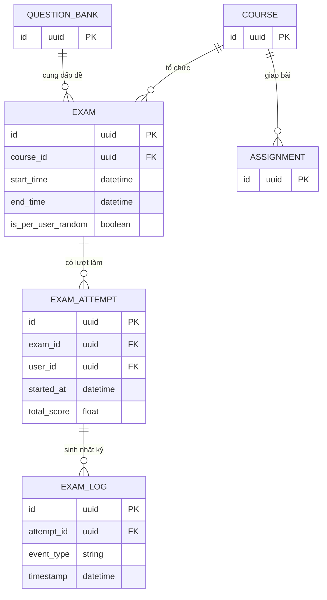
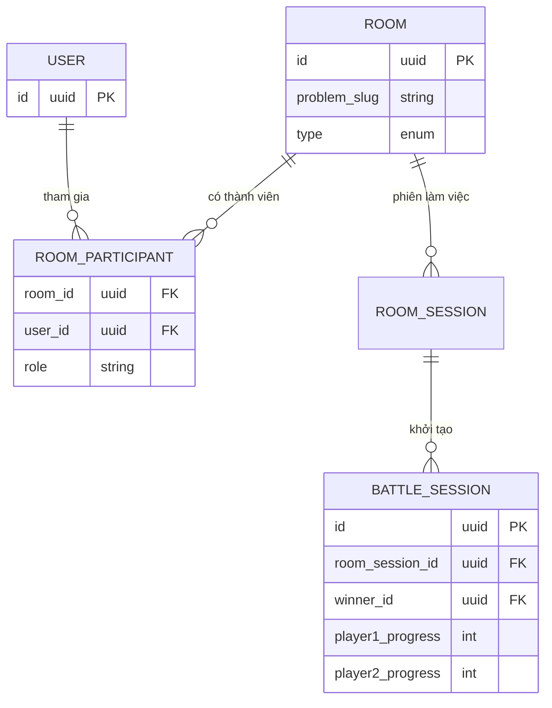
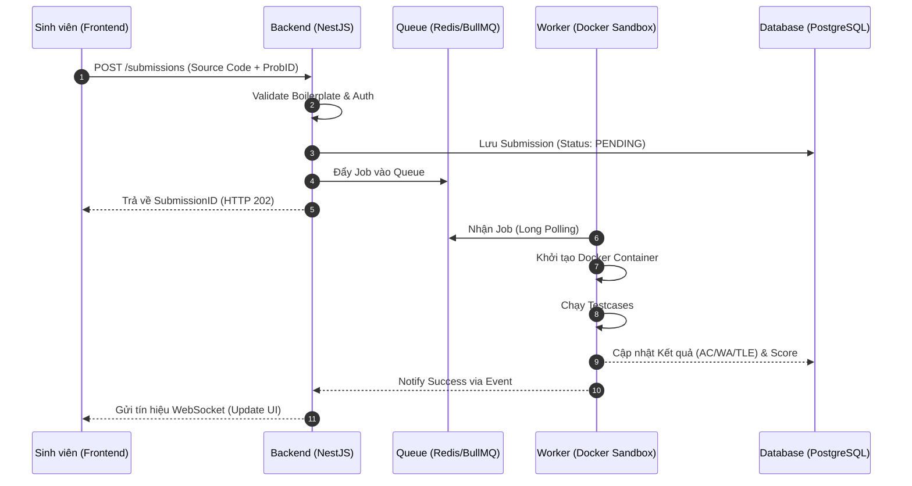
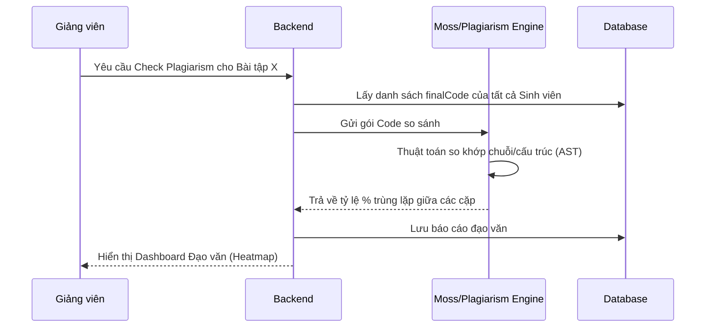
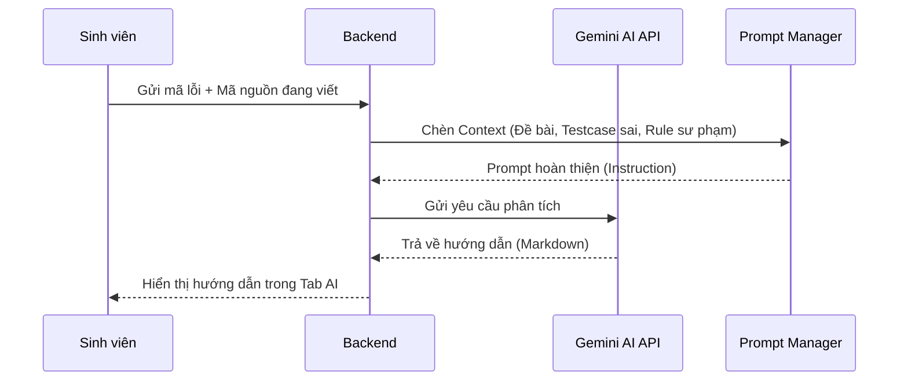

# CHƯƠNG 3. PHÂN TÍCH MÔ HÌNH NGHIỆP VỤ VÀ CHI TIẾT THỰC THỂ HỆ THỐNG

Chương này tập trung vào việc giải phẫu toàn diện kiến trúc dữ liệu và các luồng nghiệp vụ của CodeLearn. Thay vì tiếp cận theo hướng mô tả chức năng, chúng tôi đi sâu vào từng thuộc tính (field) của các thực thể (entities), các mối quan hệ (relationships) và các quy trình rẽ nhánh logic nhằm đảm bảo hệ thống có khả năng vận hành ổn định, bảo mật và đáp ứng các tiêu chuẩn khắt khe của một đồ án tốt nghiệp chuyên sâu.

### 3.1. Phân tích chi tiết các Phân hệ Thực thể (Detailed Entities Analysis)

Để quản lý một lượng lớn dữ liệu phát sinh từ hàng ngàn sinh viên và hàng triệu lượt nộp bài, CodeLearn quy hoạch dữ liệu thành 5 phân hệ thực thể hạt nhân. Dưới đây là phân tích chi tiết từng trường dữ liệu và ý nghĩa kỹ thuật của chúng.

#### 3.1.1. Phân hệ Quản trị Người dùng và Lộ trình (User & Learning Path Module)

Phân hệ này không chỉ lưu trữ thông tin cá nhân mà còn theo dõi sự phát triển kỹ năng của sinh viên thông qua cấu trúc cây (Tree structure).

**A. Thực thể USER (Người dùng)**
Thực thể trung tâm, định danh mọi tác nhân tham gia hệ thống.

| Tên trường | Kiểu dữ liệu | Đặc điểm | Ý nghĩa & Vai trò |
| :--- | :--- | :--- | :--- |
| `id` | UUID | PK, Unique | Định danh duy nhất toàn cầu, tránh việc đoán ID qua URL. |
| `email` | String(150) | Unique, Index | Email chính quy do nhà trường cấp, dùng để Onboarding. |
| `fullName` | String(100) | Not Null | Họ và tên đầy đủ để xuất báo cáo PDF/Word. |
| `mssv` | String(20) | Nullable | Mã số sinh viên phục vụ việc đối soát với Phòng Đào tạo. |
| `role` | Enum | ADMIN, LECTURER, STUDENT | Phân quyền truy cập tài nguyên (RBAC). |
| `passwordHash` | String | Encrypted | Lưu trữ mật khẩu đã mã hóa, đảm bảo an toàn tuyệt đối. |
| `status` | String | Default: 'active' | Trạng thái tài khoản (Active, Pending, Blocked). |
| `rating` | Integer | Default: 1500 | Chỉ số Elo phản ánh trình độ thi đấu Code Battle. |
| `xp` | Integer | Default: 0 | Điểm kinh nghiệm tích lũy từ các bài tập tự luyện. |

**B. Thực thể USER_SKILL_NODE (Nút kỹ năng)**
Đại diện cho một kỹ năng (ví dụ: "Mảng 1 chiều", "Đệ quy") trong cây lộ trình học tập.

| Tên trường | Kiểu dữ liệu | Ý nghĩa kỹ thuật |
| :--- | :--- | :--- |
| `parentId` | UUID | Khóa ngoại tham chiếu đến chính nó, tạo cấu trúc phân cấp cây. |
| `tag` | String | Nhãn kỹ năng dùng để lọc bài tập gợi ý từ Gemini AI. |
| `progress` | Float | Tỷ lệ hoàn thành các bài tập thuộc kỹ năng này (0.0 - 1.0). |
| `status` | Enum | `LOCKED` (Chưa đạt điều kiện), `ACTIVE` (Đang học), `DONE` (Đã nắm vững). |
| `position_x/y` | Float | Tọa độ để vẽ sơ đồ Skill Tree trên giao diện Frontend (Canvas/SVG). |

***

#### 3.1.2. Phân hệ Quản lý Bài tập và Tài nguyên (Problem & Asset Module)

Phân hệ này được thiết kế theo mô hình **Versioning** (Quản lý phiên bản) để đảm bảo tính lịch sử và không làm gãy các lượt nộp bài cũ khi đề bài thay đổi.

**A. Thực thể PROBLEM (Bài toán)**
Thực thể gốc chứa các thông tin định danh bài tập.

| Tên trường | Kiểu dữ liệu | Vai trò |
| :--- | :--- | :--- |
| `slug` | String | Chuỗi định danh URL (ví dụ: `giai-thuat-sap-xep`), hỗ trợ SEO và dễ nhớ. |
| `difficulty` | String | Phân cấp độ khó: EASY, MEDIUM, HARD để tính toán điểm thưởng. |
| `visibility` | Enum | PUBLIC (Tất cả thấy), PRIVATE (Chỉ lớp học thấy). |
| `current_version_id` | UUID | Trỏ tới phiên bản mới nhất đang được sử dụng để chấm điểm. |

**B. Thực thể PROBLEM_VERSION (Phiên bản bài tập)**
Lưu trữ nội dung chi tiết của một lần cập nhật đề bài.

| Tên trường | Kiểu dữ liệu | Ý nghĩa |
| :--- | :--- | :--- |
| `description` | JSONB | Chứa nội dung đề bài định dạng Markdown (hỗ trợ công thức Toán, Code). |
| `workspaceConfig` | JSONB | Cấu hình các tab file mặc định khi sinh viên mở Editor. |
| `entryFile` | String | Đường dẫn file chính (ví dụ: `main.cpp`) mà Sandbox sẽ thực thi. |
| `isVerified` | Boolean | Đánh dấu phiên bản đã được Giảng viên chạy thử thành công (Safe to deploy). |

**C. Thực thể PROBLEM_FILE (Tệp tin mã nguồn mẫu)**
Lưu trữ các tệp tin cấu thành nên một bài tập, đặc biệt quan trọng cho dạng bài "Điền vào chỗ trống".

| Tên trường | Kiểu dữ liệu | Mô tả chi tiết |
| :--- | :--- | :--- |
| `path` | String | Đường dẫn file trong cấu trúc thư mục ảo của sinh viên. |
| `content` | Text | Nội dung mã nguồn mẫu (Boilerplate). |
| `type` | Enum | `TEMPLATE` (Cho phép sửa), `SOLUTION` (Lời giải ẩn), `NEUTRAL` (Chỉ đọc). |
| `isReadonly` | Boolean | Cờ bảo vệ ngăn sinh viên xóa hoặc sửa đổi các tệp cấu trúc lõi. |
| `isFillInTheBlank` | Boolean | Đánh dấu tệp chứa các phân vùng ranh giới (Marking chunks). |

***

#### 3.1.3. Phân hệ Kiểm thử và Đánh giá (Testcase & Submission Module)

Đây là phân hệ lưu trữ khối lượng dữ liệu lớn nhất, đòi hỏi sự tối ưu hóa cao về chỉ mục (Indexing) và truy vấn.

**A. Thực thể TESTCASE (Bộ kiểm thử)**
Dữ liệu dùng để đối soát kết quả đầu ra của sinh viên.

| Tên trường | Kiểu dữ liệu | Ý nghĩa |
| :--- | :--- | :--- |
| `input` | Text | Dữ liệu đầu vào truyền qua Standard Input (stdin). |
| `expectedOutput` | Text | Kết quả mong đợi để so khớp (Exact match / Partial match). |
| `score` | Integer | Trọng số điểm cho testcase này (ví dụ: 10 điểm). |
| `isHidden` | Boolean | Nếu là `true`, sinh viên không thấy Input/Output này kể cả khi làm sai. |

**B. Thực thể SUBMISSION (Lượt nộp bài)**
Lưu trữ bằng chứng học tập và kết quả chấm điểm.

| Tên trường | Kiểu dữ liệu | Chi tiết kỹ thuật |
| :--- | :--- | :--- |
| `status` | Enum | `AC` (Đúng), `WA` (Sai), `TLE` (Quá thời gian), `CE` (Lỗi biên dịch). |
| `finalCode` | Text | Toàn bộ mã nguồn sinh viên đã nộp (dùng cho Plagiarism Check). |
| `executionTime` | Integer | Thời gian chạy thực tế tính bằng miligiây (ms). |
| `memoryUsage` | Integer | Lượng RAM tiêu thụ cao nhất tính bằng Kilobytes (KB). |

***

### 3.2. Sơ đồ Cơ sở Dữ liệu Phân mảnh (Detailed Module ERDs)

Thay vì một sơ đồ tổng quát khó quan sát, chúng tôi phân tách thành các ERD chi tiết cho từng nhóm nghiệp vụ.

#### 3.3.1. ERD Nhóm Người dùng & Đào tạo (User & Enrollment)
Sơ đồ này thể hiện mối quan hệ giữa sinh viên, lớp học và lộ trình kỹ năng.



#### 3.3.2. ERD Nhóm Bài tập & Kiểm thử (Problem & Submission)
Đây là cấu trúc "xương sống" xử lý logic chấm điểm của CodeLearn.



#### 3.1.4. Phân hệ Đào tạo và Thi cử (Exam & Assignment Module)

Phân hệ này quản lý các kỳ kiểm tra tập trung, đòi hỏi sự kiểm soát nghiêm ngặt về thời gian và tính ngẫu nhiên của đề thi.

**A. Thực thể EXAM (Kỳ thi tập trung)**
Quản lý các thông số vận hành của một kỳ thi chính thức.

| Tên trường | Kiểu dữ liệu | Ý nghĩa & Quy tắc |
| :--- | :--- | :--- |
| `startTime / endTime` | DateTime | Khoảng thời gian hệ thống mở/đóng cổng thi. Ngoài giờ này, sinh viên không thể truy cập. |
| `duration` | Integer | Thời lượng làm bài tính bằng phút (ví dụ: 90 phút). |
| `allowedLanguageIds`| Array[Int] | Danh sách các ngôn ngữ lập trình được phép sử dụng trong kỳ thi này. |
| `isPerUserRandom` | Boolean | **Cơ chế chống gian lận:** Mỗi sinh viên sẽ nhận được một bộ đề bài ngẫu nhiên từ ngân hàng câu hỏi. |
| `generationRules` | JSONB | Các quy tắc chọn đề (ví dụ: Chọn 2 bài Dễ, 2 bài Trung bình, 1 bài Khó). |

**B. Thực thể EXAM_LOG (Nhật ký giám thi số)**
Lưu trữ các hành vi của sinh viên trong quá trình thi.

| Tên trường | Kiểu dữ liệu | Ý nghĩa kỹ thuật |
| :--- | :--- | :--- |
| `event_type` | String | `TAB_SWITCH` (Chuyển tab), `PASTE` (Dán code), `CONNECTION_LOST`. |
| `metadata` | JSONB | Lưu thông tin chi tiết về sự kiện (ví dụ: Tên tab sinh viên đã chuyển sang). |

***

#### 3.1.5. Phân hệ Thi đấu và Cộng tác thời gian thực (Battle & Room Module)

Đây là phân hệ ứng dụng công nghệ WebSockets (Socket.io) để duy trì sự đồng bộ trạng thái giữa các người chơi.

**A. Thực thể BATTLE_SESSION (Trận đấu đối kháng)**
Quản lý vòng đời của một trận Solo Battle 1vs1.

| Tên trường | Kiểu dữ liệu | Vai trò |
| :--- | :--- | :--- |
| `player1_id / player2_id` | UUID | Hai người chơi tham gia trận đấu. |
| `player1_progress / 2` | Integer | Số lượng test case đã vượt qua. Dùng để cập nhật thanh tiến trình trực quan. |
| `winner_id` | UUID | Người hoàn thành bài tập sớm nhất với số test case vượt qua cao nhất. |
| `status` | Enum | `WAITING` (Chờ đối thủ), `ACTIVE` (Đang thi đấu), `ENDED` (Kết thúc). |

**B. Thực thể ROOM (Phòng học nhóm)**
Không gian cho phép giảng viên hướng dẫn hoặc sinh viên cùng học tập.

| Tên trường | Kiểu dữ liệu | Ý nghĩa |
| :--- | :--- | :--- |
| `type` | Enum | `MEETING` (Thảo luận video), `CODE` (Cùng lập trình trên IDE). |
| `problem_slug` | String | Bài tập mà cả phòng đang cùng thực hiện. |
| `maxParticipants` | Integer | Giới hạn số lượng người tham gia để đảm bảo băng thông ổn định. |

***

### 3.2. Sơ đồ Cơ sở Dữ liệu Phân mảnh (Tiếp theo)

#### 3.2.3. ERD Nhóm Thi cử & Đào tạo (Exam & Course)


#### 3.2.4. ERD Nhóm Cộng tác & Thi đấu (Collaboration & Battle)


***

### 3.4. Thiết kế các Luồng Nghiệp vụ Sequence Chi tiết (Sequence Diagrams)

Phần này đặc tả trình tự giao tiếp giữa Client, Server, Database và các dịch vụ bên thứ 3 (AI, Sandbox).

#### 3.4.1. Luồng Chấm bài Tự động với Cơ chế Hàng đợi (Execution Flow)
Đây là luồng quan trọng nhất, đảm bảo hệ thống không bị quá tải.



#### 3.4.2. Luồng Kiểm tra Đạo văn và Đối soát (Plagiarism Check Flow)
Luồng này giúp giảng viên đánh giá tính trung thực của sinh viên.



#### 3.4.3. Luồng Tương tác Trợ lý AI (AI Suggestion Flow)


### 3.5. Phân tích chi tiết Cấu trúc Dữ liệu Giao tiếp (API Payload Analysis)

Để đảm bảo tính nhất quán và hiệu năng, CodeLearn quy chuẩn hóa các gói tin JSON trao đổi giữa Frontend và Backend. Dưới đây là phân tích chi tiết cho hai luồng dữ liệu quan trọng nhất.

#### 3.5.1. Cấu trúc Gói tin nộp bài (Submission Payload)
Khi sinh viên bấm nút Submit, hệ thống không gửi toàn bộ file mà gửi một cấu trúc cây mã nguồn đã được định dạng.

**Endpoint:** `POST /api/submissions`
**Cấu trúc dữ liệu:**
```json
{
  "problemId": "uuid-v4-identifier",
  "languageId": 1, // 1: C++, 2: Java, 3: Python...
  "code": {
    "files": [
      {
        "path": "src/main.cpp",
        "content": "string_content_of_the_code",
        "isEntry": true
      },
      {
        "path": "src/utils.h",
        "content": "string_content_of_header"
      }
    ]
  },
  "metadata": {
    "clientTimestamp": "2026-04-30T...",
    "browserInfo": "Chrome/124.0.0",
    "isExamMode": false
  }
}
```
**Phân tích kỹ thuật:**
- `languageId`: Giúp Backend xác định chính xác Docker Image nào cần khởi tạo (ví dụ: `gcc:latest` cho C++).
- `files`: Cấu trúc mảng cho phép hệ thống mở rộng sang các bài tập đa file (Multi-file projects), một tính năng vượt trội so với các hệ thống chỉ hỗ trợ 1 file duy nhất.

#### 3.5.2. Giải thuật Nội suy và Bảo vệ ranh giới (Boilerplate Protection Algorithm)
Đây là phần lõi kỹ thuật nhằm ngăn chặn việc sinh viên can thiệp vào mã nguồn khung.

**Bước 1: Lưu trữ ranh giới (Server-side)**
Giảng viên định nghĩa vùng được phép sửa thông qua các thẻ đánh dấu ẩn trong code:
`/* START_STUDENT_CODE */` ... `/* END_STUDENT_CODE */`

**Bước 2: Đối soát khi nộp bài**
Khi nhận Payload từ Client, Backend thực hiện quy trình:
1.  Tải mã nguồn khung (Boilerplate) từ Database.
2.  Trích xuất phần mã sinh viên đã gửi trong mảng `files`.
3.  Sử dụng biểu thức chính quy (Regex) hoặc kỹ thuật cắt chuỗi để thay thế chính xác phần mã sinh viên vào giữa hai thẻ đánh dấu trong mã nguồn khung.
4.  Nếu sinh viên cố tình gửi mã nguồn nằm ngoài ranh giới (bằng cách sử dụng Postman hay can thiệp API), Engine Merge sẽ tự động loại bỏ hoặc báo lỗi `Security Violation`.

***

### 3.6. Thiết kế Giao diện lập trình (API Endpoints Specification)

Dưới đây là bảng đặc tả một số API hạt nhân phục vụ các phân hệ chính:

| Phương thức | Endpoint | Mô tả chức năng | Quyền hạn (Role) |
| :--- | :--- | :--- | :--- |
| `GET` | `/api/problems` | Lấy danh sách bài tập kèm bộ lọc nâng cao. | ALL |
| `POST` | `/api/problems` | Khởi tạo bài tập mới, bao gồm định nghĩa Metadata. | LECTURER |
| `GET` | `/api/submissions/:id` | Lấy kết quả chấm bài chi tiết kèm log Sandbox. | OWNER / LECTURER |
| `POST` | `/api/battles/join` | Tìm kiếm và gia nhập phòng chờ đối kháng. | STUDENT |
| `PATCH` | `/api/admin/users/:id` | Cập nhật thông tin và trạng thái tài khoản. | ADMIN |
| `GET` | `/api/ai/suggest` | Gửi yêu cầu phân tích lỗi và nhận gợi ý từ AI. | STUDENT |

***
*Kết luận Chương 3: Với sự phân tách rõ ràng giữa các thực thể, luồng nghiệp vụ và đặc tả giao tiếp, hệ thống CodeLearn đã xây dựng được một nền tảng vững chắc, sẵn sàng cho việc hiện thực hóa các giao diện phức tạp ở Chương tiếp theo.*
