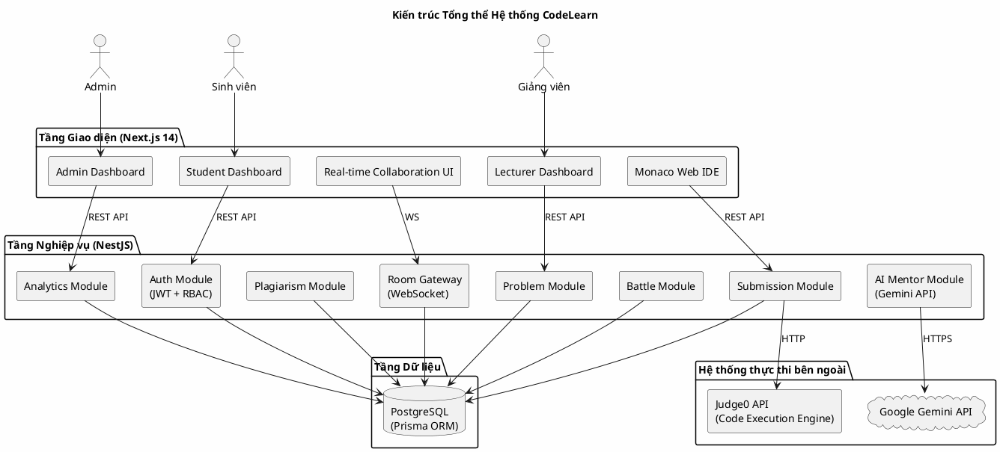
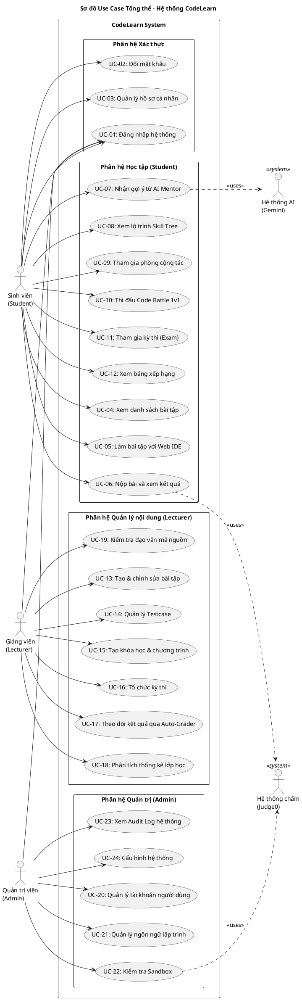

## 3.1. Kiến trúc hệ thống

### 3.1.1. Mô hình kiến trúc Client-Server và phân tách trách nhiệm

CodeLearn được xây dựng theo mô hình kiến trúc phân tầng (Layered Architecture) kết hợp với triết lý phân tách mối quan tâm (Separation of Concerns). Toàn bộ hệ thống được chia thành ba tầng độc lập, giao tiếp với nhau thông qua các giao thức chuẩn hóa:

- **Tầng Giao diện (Presentation Layer):** Được xây dựng bằng **Next.js 14** theo mô hình App Router, chịu trách nhiệm toàn bộ trải nghiệm người dùng. Tầng này giao tiếp với Backend thông qua REST API (cho các yêu cầu CRUD thông thường) và WebSocket (cho các tính năng thời gian thực như phòng cộng tác và theo dõi kết quả chấm bài).
- **Tầng Nghiệp vụ (Business Logic Layer):** Được xây dựng bằng **NestJS** (Node.js framework), đây là trung tâm xử lý logic toàn hệ thống. Tầng này nhận yêu cầu, xác thực phân quyền (RBAC), điều phối các luồng nghiệp vụ và giao tiếp với cả cơ sở dữ liệu lẫn hệ thống thực thi mã nguồn bên ngoài.
- **Tầng Dữ liệu (Data Layer):** Sử dụng **PostgreSQL** làm cơ sở dữ liệu quan hệ chính, quản lý toàn bộ dữ liệu người dùng, bài tập, kết quả chấm bài và trạng thái hệ thống. ORM **Prisma** đóng vai trò trừu tượng hóa các truy vấn phức tạp và quản lý schema migration.

### 3.1.2. Sơ đồ kiến trúc tổng thể

**Hình 3.1. Sơ đồ kiến trúc tổng thể hệ thống CodeLearn**

*[Ghi chú: Sơ đồ Component Diagram dưới đây được vẽ bằng PlantUML. Render tại: https://www.plantuml.com/plantuml/uml/]*

### 3.1.3. Các quyết định kiến trúc quan trọng

**A. Lựa chọn Next.js 14 với App Router**
Next.js 14 được lựa chọn vì khả năng hỗ trợ cả Server-Side Rendering (SSR) lẫn Client-Side Rendering (CSR) trong cùng một ứng dụng. Điều này cho phép tối ưu hóa SEO cho các trang công khai (danh sách bài tập) trong khi vẫn đảm bảo tính tương tác cao cho các trang yêu cầu cập nhật thời gian thực (Editor, Leaderboard).

**B. Lựa chọn NestJS**
NestJS cung cấp kiến trúc module hóa mạnh mẽ, được lấy cảm hứng từ Angular. Mỗi tính năng (Problems, Submissions, Battles...) được đóng gói thành một Module độc lập với Controller, Service và Repository riêng, tuân thủ nguyên tắc Single Responsibility và tạo điều kiện cho việc mở rộng và kiểm thử độc lập.

**C. Tích hợp Judge0 thay vì tự xây dựng Sandbox**
Thay vì tự xây dựng hệ thống thực thi mã nguồn từ đầu (tốn kém và nhiều rủi ro bảo mật), CodeLearn tích hợp **Judge0** — engine thực thi mã nguồn mã nguồn mở đã được kiểm chứng trong môi trường sản xuất — thông qua REST API. Quyết định này cho phép nhóm tập trung nguồn lực vào phát triển tính năng giáo dục đặc thù (AI Mentor, Skill Tree, Collaboration) thay vì giải quyết các vấn đề Sandbox cấp thấp.

---

## 3.2. Sơ đồ Use Case

### 3.2.1. Xác định các tác nhân hệ thống (Actors)

Hệ thống CodeLearn phục vụ ba nhóm tác nhân chính với phạm vi quyền hạn được kiểm soát chặt chẽ theo mô hình RBAC (Role-Based Access Control):

| Tác nhân | Vai trò | Quyền hạn cốt lõi |
| :--- | :--- | :--- |
| **Sinh viên (Student)** | Người học và thi | Luyện tập, nộp bài, xem kết quả, tương tác AI, thi đấu |
| **Giảng viên (Lecturer)** | Người quản lý nội dung | Tạo bài tập, quản lý khóa học, tổ chức thi, giám sát kết quả |
| **Quản trị viên (Admin)** | Người vận hành hệ thống | Quản lý toàn bộ người dùng, cấu hình hệ thống, xem audit log |

### 3.2.2. Sơ đồ Use Case tổng thể

**Hình 3.2. Sơ đồ Use Case tổng thể hệ thống CodeLearn**

*[Render bằng PlantUML tại: https://www.plantuml.com/plantuml/uml/]*

---

## 3.3. Đặc tả chi tiết các Use Case chính

### 3.3.1. UC-05: Làm bài tập với Web IDE

| Thuộc tính | Nội dung |
| :--- | :--- |
| **Mã Use Case** | UC-05 |
| **Tên Use Case** | Làm bài tập với Web IDE |
| **Tác nhân chính** | Sinh viên (Student) |
| **Tác nhân phụ** | Hệ thống chấm điểm (Judge0) |
| **Mô tả** | Sinh viên mở một bài tập, đọc đề bài và sử dụng trình soạn thảo mã nguồn trực tuyến (Monaco Editor) để viết code, chạy thử và nộp bài. |
| **Điều kiện tiên quyết** | Sinh viên đã đăng nhập và bài tập đang ở trạng thái `PUBLIC` hoặc thuộc khóa học sinh viên đã đăng ký. |
| **Điều kiện sau (Thành công)** | Kết quả nộp bài được lưu vào CSDL với trạng thái `AC/WA/TLE/CE`. Điểm XP và tiến độ Skill Tree được cập nhật nếu đạt `AC`. |
| **Điều kiện sau (Thất bại)** | Hệ thống trả về thông báo lỗi phù hợp. Không cập nhật điểm số. |

**Luồng xử lý chính (Main Flow):**
1. Sinh viên truy cập trang danh sách bài tập và chọn một bài.
2. Hệ thống tải nội dung đề bài (Markdown) và cấu hình workspace (danh sách file, boilerplate code) từ phiên bản hiện tại (`current_version_id`).
3. Monaco Editor khởi tạo với các tab file tương ứng. Sinh viên viết/chỉnh sửa mã nguồn trong vùng được phép.
4. Sinh viên nhấn "Chạy thử" (Run): Hệ thống gửi mã nguồn kèm `languageId` và bộ testcase công khai đến Judge0 API. Kết quả trả về hiển thị trong terminal dưới Editor trong thời gian thực.
5. Sinh viên nhấn "Nộp bài" (Submit): Hệ thống thực hiện quy trình nộp bài đầy đủ với tất cả testcase bao gồm cả testcase ẩn.
6. Hệ thống hiển thị kết quả chi tiết từng testcase, điểm số và thứ hạng.

**Luồng xử lý thay thế:**
- **(5a) Bài tập dạng "Điền vào chỗ trống" (Fill-in-the-blank):** Backend thực hiện thêm bước "Merge" — chèn mã của sinh viên vào đúng vị trí ranh giới trong boilerplate trước khi gửi sang Judge0.
- **(5b) Mã nguồn vượt quá giới hạn kích thước:** Hệ thống từ chối yêu cầu và trả về lỗi `PAYLOAD_TOO_LARGE` trước khi gửi sang Judge0.

---

### 3.3.2. UC-07: Nhận gợi ý từ AI Mentor

| Thuộc tính | Nội dung |
| :--- | :--- |
| **Mã Use Case** | UC-07 |
| **Tên Use Case** | Nhận gợi ý từ AI Mentor |
| **Tác nhân chính** | Sinh viên (Student) |
| **Tác nhân phụ** | Google Gemini API |
| **Mô tả** | Khi gặp khó khăn, sinh viên yêu cầu AI phân tích lỗi trong mã nguồn và đưa ra gợi ý theo phong cách Socratic (không tiết lộ đáp án trực tiếp). |
| **Điều kiện tiên quyết** | Sinh viên đang trong phiên làm bài; mã nguồn đã có ít nhất một lần thực thi thất bại. |
| **Điều kiện sau (Thành công)** | AI trả về đoạn gợi ý dưới dạng câu hỏi định hướng, hiển thị trong panel AI Mentor. |

**Luồng xử lý chính:**
1. Sinh viên nhấn nút "Hỏi AI Mentor" trong giao diện Editor.
2. Frontend thu thập: mã nguồn hiện tại, thông báo lỗi (stderr) từ lần chạy cuối, đề bài bài toán và ngôn ngữ lập trình.
3. Backend NestJS xây dựng prompt đa tầng: lớp prompt tĩnh (định nghĩa vai trò sư phạm — AI phải hỏi ngược lại chứ không giải bài thẳng) kết hợp với lớp prompt động (ngữ cảnh cụ thể từ bước 2).
4. Gọi Gemini API với prompt đã được tổng hợp.
5. Nhận kết quả văn bản từ Gemini, stream (dòng chữ xuất hiện dần) về phía Frontend.
6. Phản hồi hiển thị trong giao diện dưới dạng chat bubble của "CodeMentor".

**Ràng buộc quan trọng:** AI tuyệt đối không được trả về code giải hoàn chỉnh. System Prompt được thiết kế với các chỉ thị nghiêm ngặt để buộc AI đặt câu hỏi gợi mở thay vì cung cấp đáp án.

---

### 3.3.3. UC-13: Tạo và chỉnh sửa bài tập

| Thuộc tính | Nội dung |
| :--- | :--- |
| **Mã Use Case** | UC-13 |
| **Tên Use Case** | Tạo và chỉnh sửa bài tập |
| **Tác nhân chính** | Giảng viên (Lecturer) |
| **Tác nhân phụ** | Hệ thống chấm điểm (Judge0) |
| **Mô tả** | Giảng viên khởi tạo một bài tập mới, bao gồm soạn đề bài, cấu hình workspace đa file, định nghĩa testcase và chạy thử để xác minh bài tập trước khi công bố. |
| **Điều kiện tiên quyết** | Người dùng có vai trò `LECTURER` hoặc `ADMIN`, đã đăng nhập. |
| **Điều kiện sau (Thành công)** | Bài tập được lưu vào CSDL với trạng thái `PUBLIC` hoặc `PRIVATE` tùy lựa chọn của giảng viên. Một `PROBLEM_VERSION` mới được khởi tạo. |

**Luồng xử lý chính:**
1. Giảng viên truy cập trang "Tạo bài tập mới" trong Lecturer Dashboard.
2. Điền thông tin Metadata: tiêu đề, mô tả (Markdown Editor), độ khó, tags kỹ năng, khả năng hiển thị (Public/Private).
3. Cấu hình Workspace: thêm/xóa các tab file, chọn loại file (TEMPLATE cho phép sửa, NEUTRAL chỉ đọc), chọn ngôn ngữ cho từng file.
4. Với dạng bài "Điền vào chỗ trống": đánh dấu các vùng sinh viên được phép chỉnh sửa bằng cú pháp ranh giới đặc biệt.
5. Thêm Testcase: nhập Input và Expected Output cho từng testcase; cấu hình điểm số và trạng thái ẩn/hiện.
6. Nhấn "Chạy thử": Hệ thống gửi code giải mẫu (solution) sang Judge0 để xác minh tính đúng đắn của testcase.
7. Nếu tất cả testcase Pass → Bài tập được đánh dấu `isVerified = true`.
8. Giảng viên nhấn "Xuất bản" → Bài tập chuyển trạng thái sang `PUBLIC`.

---

### 3.3.4. UC-09: Tham gia phòng cộng tác (Collaboration Room)

| Thuộc tính | Nội dung |
| :--- | :--- |
| **Mã Use Case** | UC-09 |
| **Tên Use Case** | Tham gia phòng lập trình cộng tác |
| **Tác nhân chính** | Sinh viên (chủ phòng hoặc người tham gia) |
| **Giao thức** | WebSocket (Socket.IO) |
| **Mô tả** | Nhiều sinh viên cùng làm việc trong một không gian ảo, mỗi người có workspace mã nguồn riêng nhưng có thể quan sát màn hình của nhau theo thời gian thực. |
| **Điều kiện tiên quyết** | Phòng phải tồn tại và đang ở trạng thái `OPEN`. Sinh viên phải có link mã phòng hợp lệ. |

**Luồng xử lý chính:**
1. Sinh viên A (Chủ phòng) tạo phòng mới với một bài toán cụ thể → Hệ thống tạo `ROOM` với mã phòng ngẫu nhiên và kết nối WebSocket.
2. Sinh viên B nhập mã phòng → Hệ thống xác thực và phát sự kiện `user-joined` đến tất cả thành viên.
3. Mỗi sinh viên làm việc trong workspace của **chính họ** (tách biệt, không ghi đè lên nhau).
4. Khi một sinh viên thay đổi code → Hệ thống phát sự kiện `workspace-updated` tới **chính người dùng đó** để lưu trữ; không tự động đồng bộ sang người khác (tránh ghi đè).
5. Sinh viên B **chủ động click** vào tên của Sinh viên A trong danh sách thành viên → Giao diện chuyển sang chế độ "Quan sát" (View-only mode), hiển thị workspace của A theo thời gian thực.
6. Người quan sát có thể nhấn "Quay về workspace của tôi" để thoát khỏi chế độ quan sát.

---

### 3.3.5. UC-10: Thi đấu Code Battle 1v1

| Thuộc tính | Nội dung |
| :--- | :--- |
| **Mã Use Case** | UC-10 |
| **Tên Use Case** | Thi đấu Code Battle 1v1 |
| **Tác nhân chính** | Sinh viên (2 người) |
| **Giao thức** | WebSocket + REST API |
| **Mô tả** | Hai sinh viên được ghép cặp ngẫu nhiên (Matchmaking) hoặc theo lời mời, cùng giải một bài toán trong thời gian giới hạn. Hệ thống Elo cập nhật điểm rating sau khi trận đấu kết thúc. |
| **Điều kiện tiên quyết** | Cả hai sinh viên đang online và đều đã kích hoạt chế độ "Tìm kiếm trận đấu". |

**Luồng xử lý:**
1. Sinh viên A và B nhấn "Tìm trận" → Hệ thống đưa cả hai vào hàng đợi Matchmaking.
2. Server ghép cặp dựa trên Rating Elo (chênh lệch nhỏ nhất), tạo `BATTLE` record và phát sự kiện `match-found`.
3. Cả hai được chuyển vào phòng chiến đấu với bài toán giống nhau và đồng hồ đếm ngược.
4. Mỗi sinh viên nộp bài độc lập. Mỗi lần nộp được chấm theo thời gian thực.
5. Người đầu tiên đạt `AC` (hoặc người có điểm số cao hơn khi hết giờ) → Thắng trận.
6. Hệ thống cập nhật điểm Rating Elo của cả hai theo công thức chuẩn: `R_new = R_old + K * (S - E)` trong đó `S` là kết quả thực tế (1 = thắng, 0 = thua) và `E` là xác suất thắng kỳ vọng.

---

### 3.3.6. UC-16: Tổ chức kỳ thi (Exam Management)

| Thuộc tính | Nội dung |
| :--- | :--- |
| **Mã Use Case** | UC-16 |
| **Tên Use Case** | Tổ chức và quản lý kỳ thi |
| **Tác nhân chính** | Giảng viên (Lecturer) |
| **Mô tả** | Giảng viên cấu hình và phát hành một kỳ thi giới hạn thời gian với bộ câu hỏi lấy từ ngân hàng đề bài. Sinh viên trong khóa học có thể tham gia trong khung thời gian quy định. |
| **Điều kiện tiên quyết** | Giảng viên đã có ít nhất một khóa học với sinh viên đã đăng ký. |
| **Điều kiện sau** | Kỳ thi được tạo với trạng thái `SCHEDULED`. Sau thời điểm bắt đầu, chuyển sang `ONGOING`. Sau thời điểm kết thúc, hệ thống tự động khóa và tổng hợp kết quả. |

**Luồng xử lý:**
1. Giảng viên chọn "Tạo kỳ thi mới" và điền thông tin: tiêu đề, thời gian bắt đầu/kết thúc, thời lượng làm bài, số lượng câu hỏi.
2. Lựa chọn bài tập từ ngân hàng đề (Question Bank) theo tag hoặc mức độ khó, hoặc kéo thả thủ công.
3. Cấu hình nâng cao: bật/tắt chế độ đề khác nhau cho từng sinh viên (Randomized Order), quy định điểm qua môn.
4. Xuất bản kỳ thi → Hệ thống gửi thông báo đến toàn bộ sinh viên trong khóa học.
5. Trong thời gian thi: sinh viên chỉ thấy các bài thi; hệ thống kiểm soát deadline cứng (không cho nộp sau giờ).
6. Sau khi kỳ thi kết thúc: Giảng viên xem bảng tổng hợp điểm tại Auto-Grader Dashboard, có thể chỉnh điểm thủ công (Manual Override) nếu cần.
