## 3.4. Biểu đồ hoạt động

*Các biểu đồ hoạt động dưới đây mô tả luồng nghiệp vụ tổng quát của hệ thống CodeLearn, tập trung vào tương tác giữa các tác nhân và các thành phần hệ thống.*

---

### 3.4.1. Biểu đồ hoạt động chức năng tham gia và xác thực tài khoản
**Hình 3.3. Biểu đồ hoạt động chức năng tham gia và xác thực tài khoản**

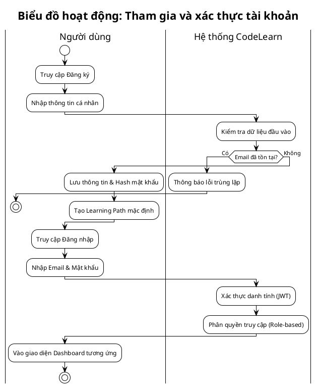

### 3.4.2. Biểu đồ hoạt động chức năng học tập theo lộ trình kỹ năng
**Hình 3.4. Biểu đồ hoạt động chức năng học tập theo lộ trình kỹ năng**

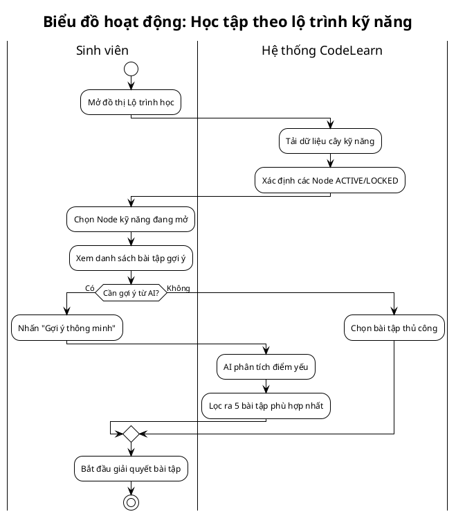

### 3.4.3. Biểu đồ hoạt động chức năng thực hành lập trình và chấm điểm tự động
**Hình 3.5. Biểu đồ hoạt động chức năng thực hành lập trình và chấm điểm tự động**

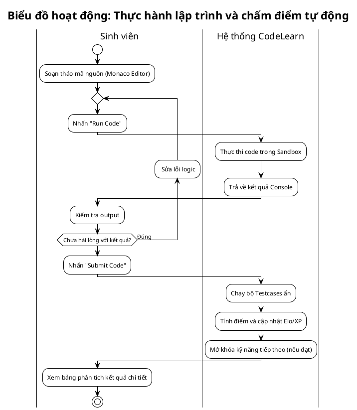

### 3.4.4. Biểu đồ hoạt động chức năng tương tác với trợ lý ảo AI Mentor
**Hình 3.6. Biểu đồ hoạt động chức năng tương tác với trợ lý ảo AI Mentor**

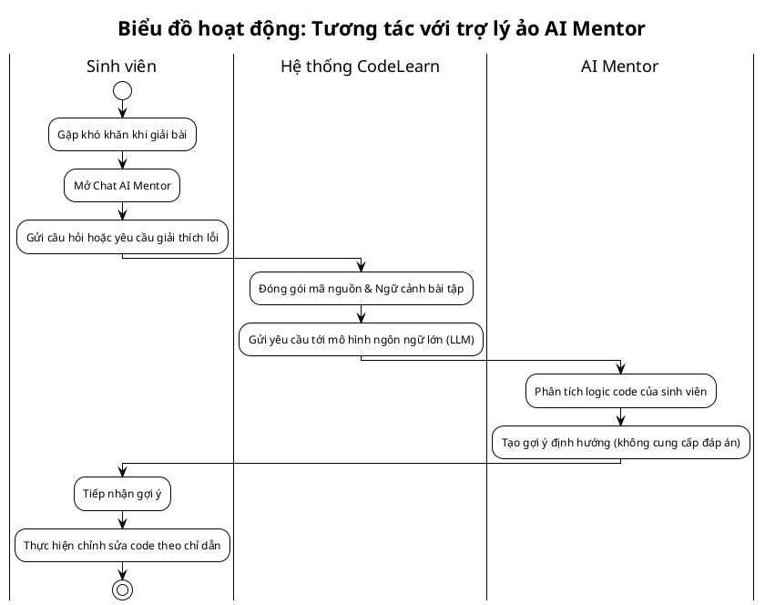

### 3.4.5. Biểu đồ hoạt động chức năng tham gia kỳ thi trực tuyến
**Hình 3.7. Biểu đồ hoạt động chức năng tham gia kỳ thi trực tuyến**

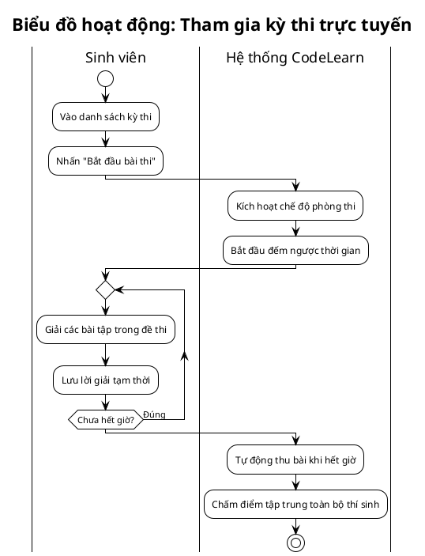

### 3.4.6. Biểu đồ hoạt động chức năng thi đấu Code Battle 1v1
**Hình 3.8. Biểu đồ hoạt động chức năng thi đấu Code Battle 1v1**

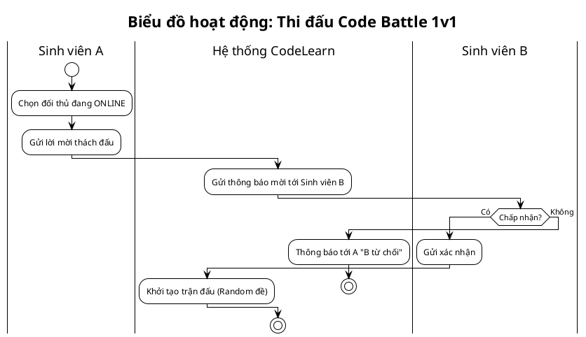

### 3.4.7. Biểu đồ hoạt động chức năng học tập nhóm trong phòng cộng tác
**Hình 3.9. Biểu đồ hoạt động chức năng học tập nhóm trong phòng cộng tác**

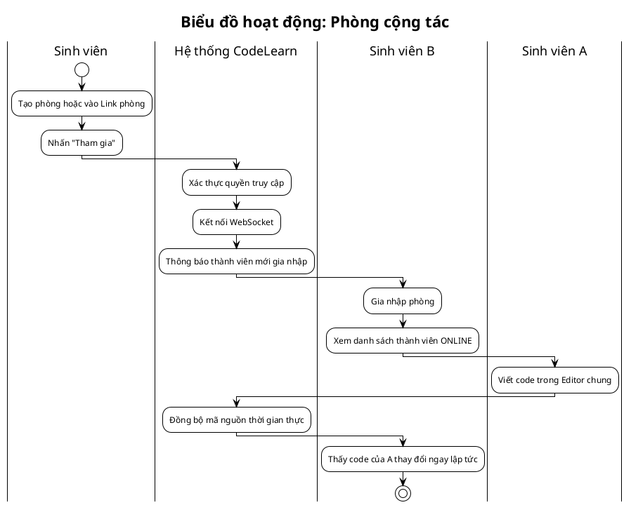


### 3.4.8. Biểu đồ hoạt động chức năng tạo và chỉnh sửa bài tập
**Hình 3.10. Biểu đồ hoạt động chức năng tạo và chỉnh sửa bài tập**

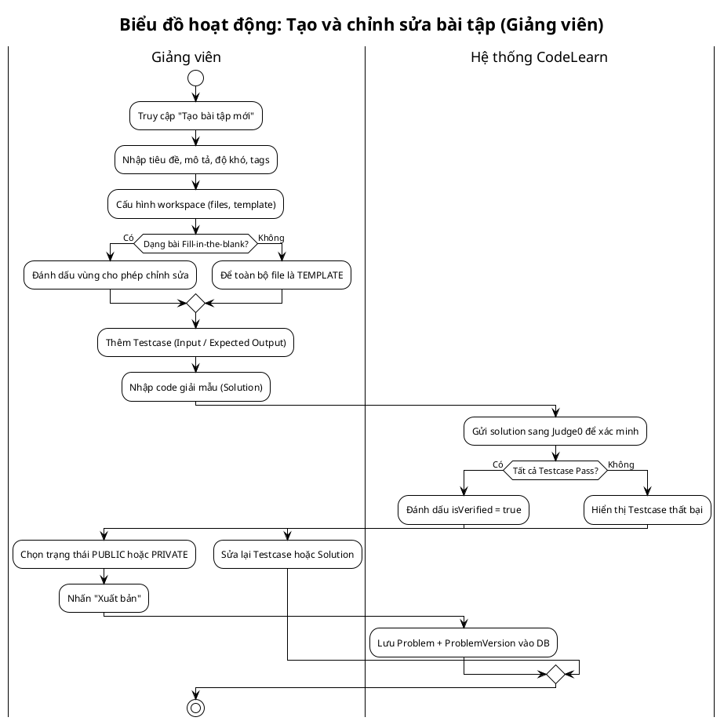

### 3.4.9. Biểu đồ hoạt động chức năng kiểm tra đạo văn mã nguồn
**Hình 3.11. Biểu đồ hoạt động chức năng kiểm tra đạo văn mã nguồn**

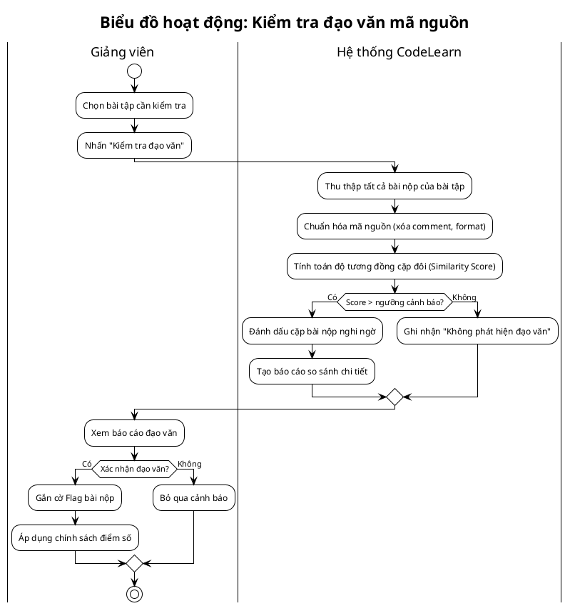

---

## 3.5. Biểu đồ tuần tự

### 3.5.1. Biểu đồ tuần tự chức năng đăng ký tài khoản
**Hình 3.12. Biểu đồ tuần tự chức năng đăng ký tài khoản**

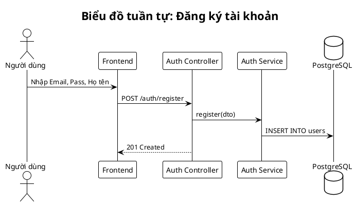

### 3.5.2. Biểu đồ tuần tự chức năng đăng nhập hệ thống
**Hình 3.13. Biểu đồ tuần tự chức năng đăng nhập hệ thống**

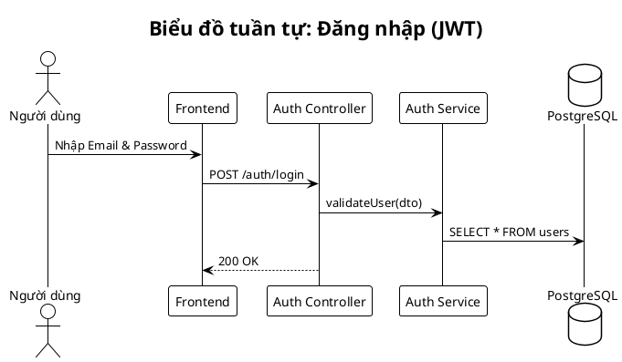

### 3.5.3. Biểu đồ tuần tự chức năng chạy thử mã nguồn
**Hình 3.14. Biểu đồ tuần tự chức năng chạy thử mã nguồn**

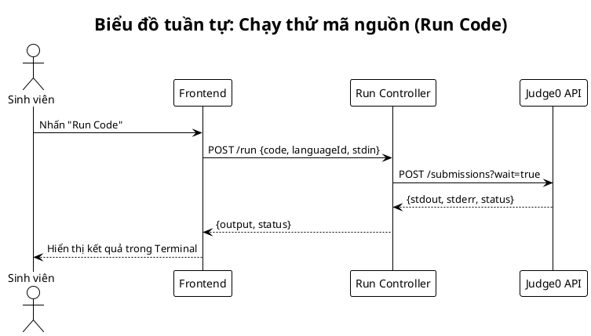

### 3.5.4. Biểu đồ tuần tự chức năng chấm điểm bài nộp
**Hình 3.15. Biểu đồ tuần tự chức năng chấm điểm bài nộp**

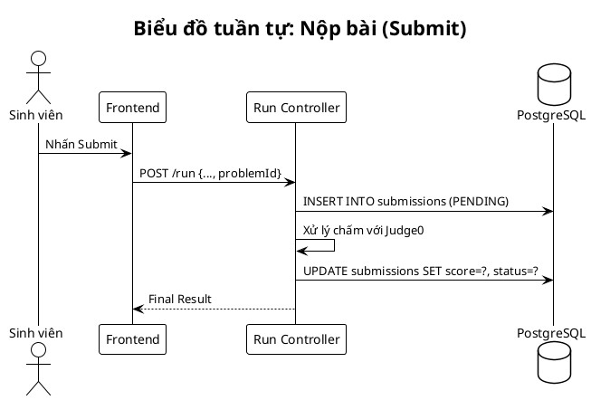

### 3.5.5. Biểu đồ tuần tự chức năng nhận gợi ý từ AI Mentor
**Hình 3.16. Biểu đồ tuần tự chức năng nhận gợi ý từ AI Mentor**

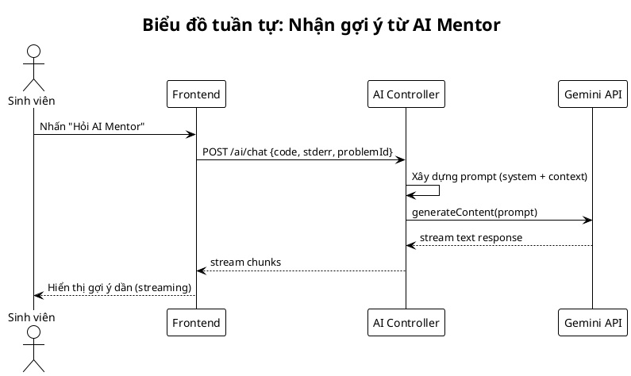

### 3.5.6. Biểu đồ tuần tự chức năng phòng cộng tác
**Hình 3.17. Biểu đồ tuần tự chức năng phòng cộng tác**

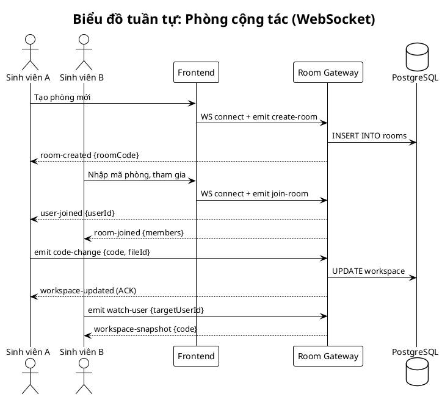

### 3.5.7. Biểu đồ tuần tự chức năng thi đấu Code Battle
**Hình 3.18. Biểu đồ tuần tự chức năng thi đấu Code Battle**

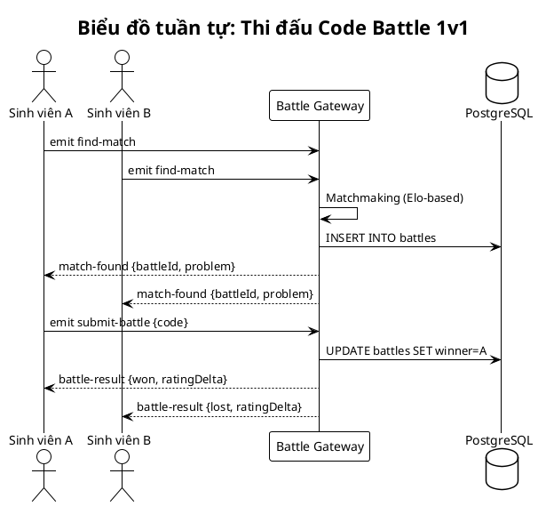

### 3.5.8. Biểu đồ tuần tự chức năng tham gia kỳ thi trực tuyến
**Hình 3.19. Biểu đồ tuần tự chức năng tham gia kỳ thi trực tuyến**

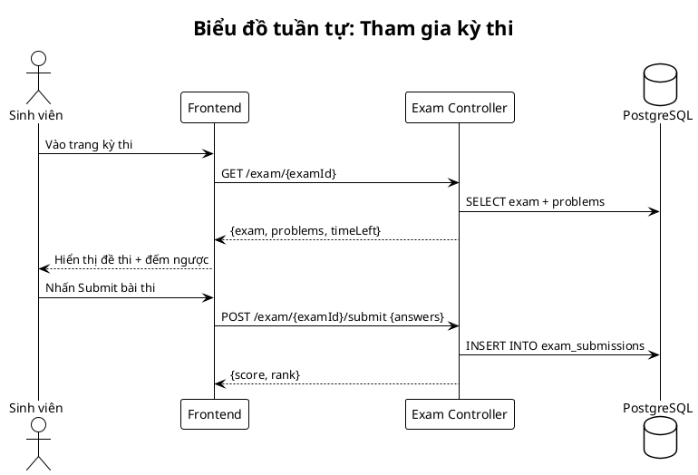

### 3.5.9. Biểu đồ tuần tự chức năng tạo bài tập của giảng viên
**Hình 3.20. Biểu đồ tuần tự chức năng tạo bài tập của giảng viên**

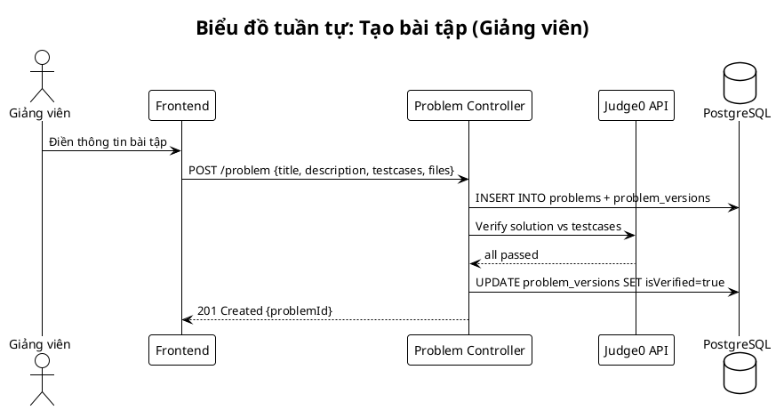

### 3.5.10. Biểu đồ tuần tự chức năng phê duyệt bài tập
**Hình 3.21. Biểu đồ tuần tự chức năng phê duyệt bài tập**

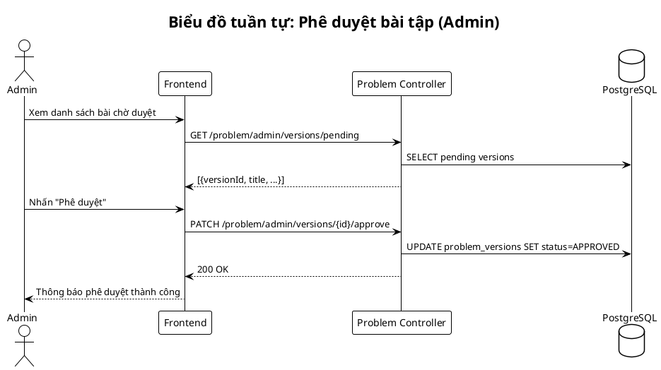

### 3.5.11. Biểu đồ tuần tự chức năng xem lộ trình học kỹ năng
**Hình 3.22. Biểu đồ tuần tự chức năng xem lộ trình học kỹ năng**

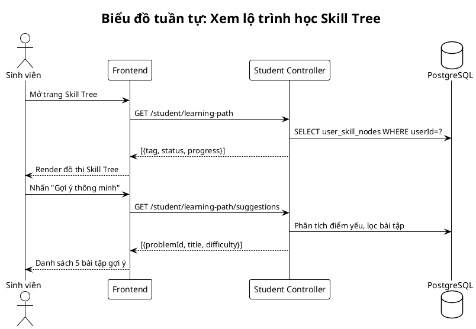

### 3.5.12. Biểu đồ tuần tự chức năng kiểm tra đạo văn mã nguồn
**Hình 3.23. Biểu đồ tuần tự chức năng kiểm tra đạo văn mã nguồn**

```plantuml
@startuml SD_Plagiarism
skinparam monochrome true
!theme plain
title Biểu đồ tuần tự: Kiểm tra đạo văn

actor "Giảng viên" as GV
participant "Frontend" as FE
participant "Plagiarism Controller" as PC
participant "Plagiarism Service" as PS
database "PostgreSQL" as DB

GV -> FE: Nhấn "Kiểm tra đạo văn"
FE -> PC: POST /plagiarism/check/{problemId}
PC -> DB: SELECT all submissions for problem
DB --> PC: submissions data
PC -> PS: checkPlagiarism(submissions)
PS -> PS: So sánh cặp đôi (MOSS/JPlag logic)
PS --> PC: results (similarity scores)
PC -> DB: INSERT INTO plagiarism_results
PC --> FE: {status: "Completed", resultId}
FE --> GV: Hiển thị danh sách các bài trùng lặp
@enduml
```

*(Lưu ý: Toàn bộ 21 biểu đồ trong mục 3.4 và 3.5 bao gồm 9 biểu đồ hoạt động (Hình 3.3–3.11) và 12 biểu đồ tuần tự (Hình 3.12–3.23), đã được đặt tên theo định dạng: Biểu đồ [Loại] chức năng [Tên chức năng].)*
