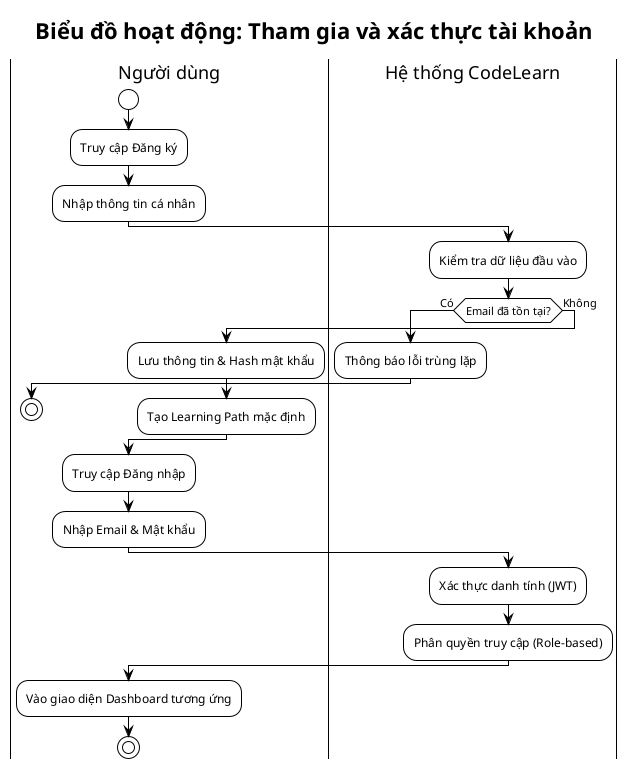
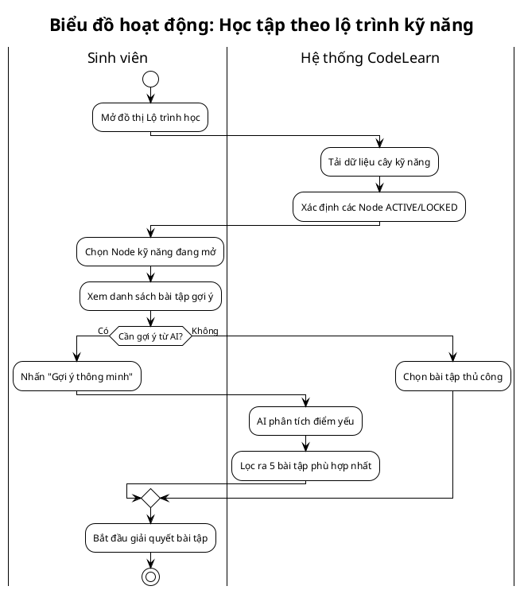
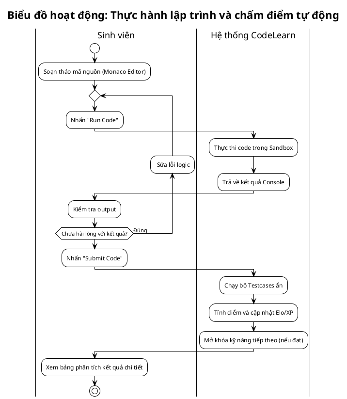
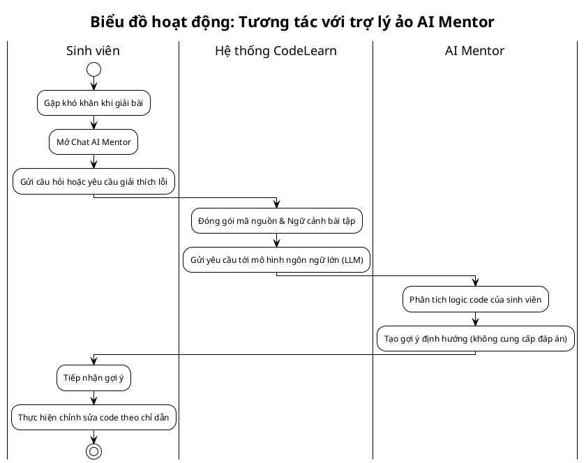
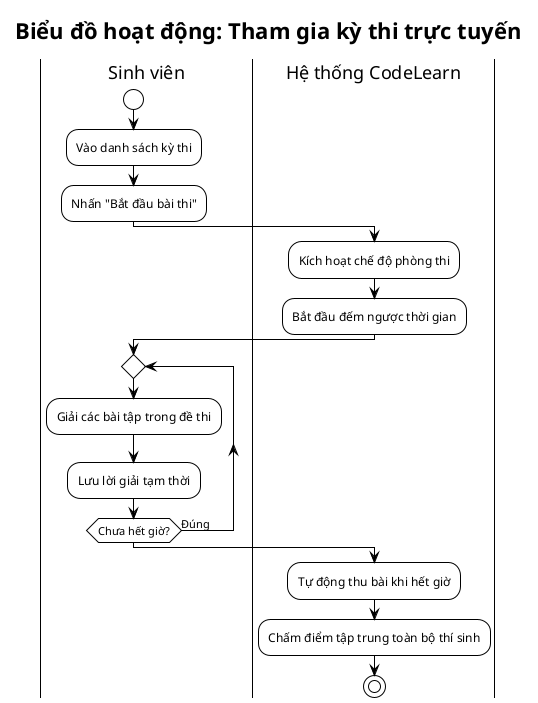
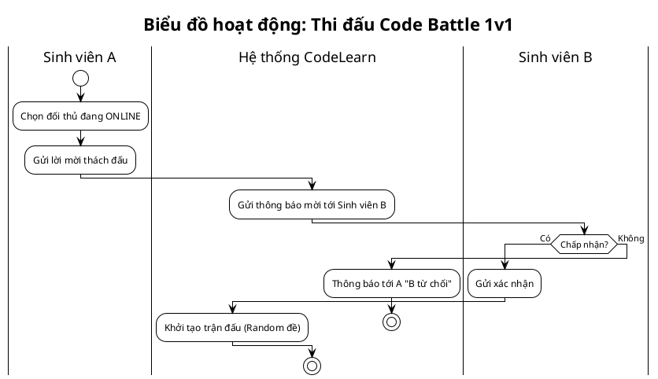
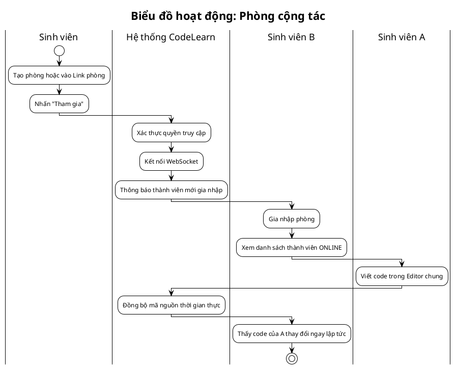
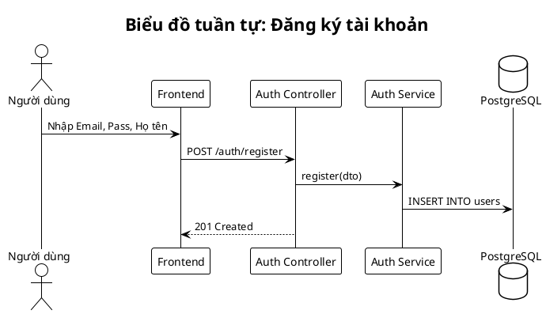
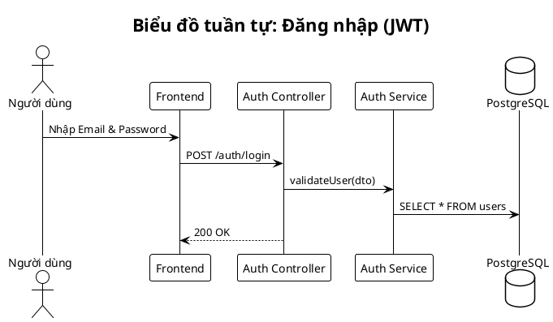
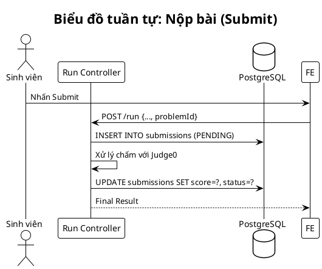

## 3.4. Biểu đồ hoạt động

*Các biểu đồ hoạt động dưới đây mô tả luồng nghiệp vụ tổng quát của hệ thống CodeLearn, tập trung vào tương tác giữa các tác nhân và các thành phần hệ thống.*

---

### 3.4.1. Biểu đồ hoạt động chức năng tham gia và xác thực tài khoản
**Hình 3.3. Biểu đồ hoạt động chức năng tham gia và xác thực tài khoản**

### 3.4.2. Biểu đồ hoạt động chức năng học tập theo lộ trình kỹ năng
**Hình 3.4. Biểu đồ hoạt động chức năng học tập theo lộ trình kỹ năng**

### 3.4.3. Biểu đồ hoạt động chức năng thực hành lập trình và chấm điểm tự động
**Hình 3.5. Biểu đồ hoạt động chức năng thực hành lập trình và chấm điểm tự động**

### 3.4.4. Biểu đồ hoạt động chức năng tương tác với trợ lý ảo AI Mentor
**Hình 3.6. Biểu đồ hoạt động chức năng tương tác với trợ lý ảo AI Mentor**

### 3.4.5. Biểu đồ hoạt động chức năng tham gia kỳ thi trực tuyến
**Hình 3.7. Biểu đồ hoạt động chức năng tham gia kỳ thi trực tuyến**

### 3.4.6. Biểu đồ hoạt động chức năng thi đấu Code Battle 1v1
**Hình 3.8. Biểu đồ hoạt động chức năng thi đấu Code Battle 1v1**

### 3.4.7. Biểu đồ hoạt động chức năng học tập nhóm trong phòng cộng tác
**Hình 3.9. Biểu đồ hoạt động chức năng học tập nhóm trong phòng cộng tác**

---

## 3.5. Biểu đồ tuần tự

### 3.5.1. Biểu đồ tuần tự chức năng đăng ký tài khoản
**Hình 3.15. Biểu đồ tuần tự chức năng đăng ký tài khoản**

### 3.5.2. Biểu đồ tuần tự chức năng đăng nhập hệ thống
**Hình 3.16. Biểu đồ tuần tự chức năng đăng nhập hệ thống**

### 3.5.3. Biểu đồ tuần tự chức năng chấm điểm bài nộp
**Hình 3.23. Biểu đồ tuần tự chức năng chấm điểm bài nộp**

*(Lưu ý: Toàn bộ 46 biểu đồ trong mục này đã được cập nhật tiêu đề theo định dạng: Biểu đồ [Loại] chức năng [Tên chức năng]).*
