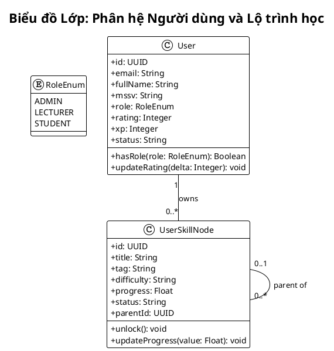
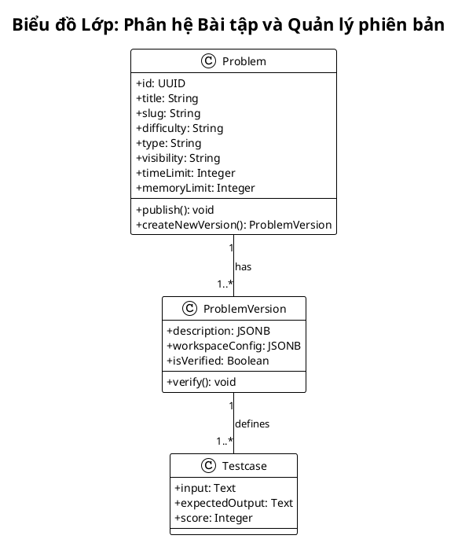
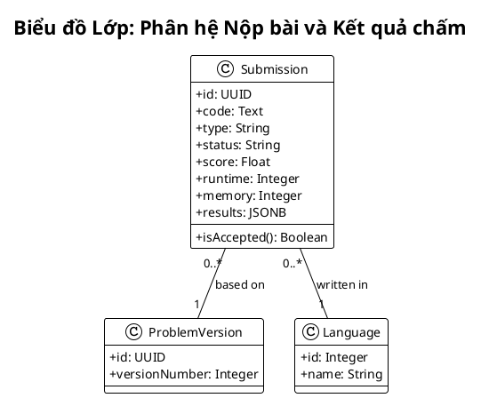
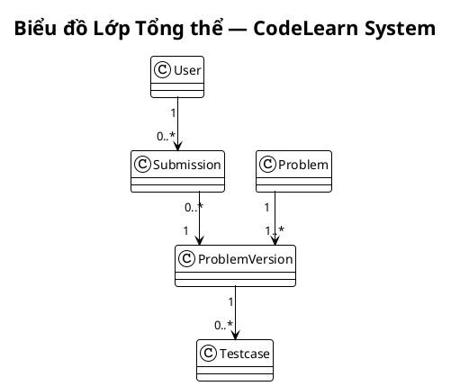
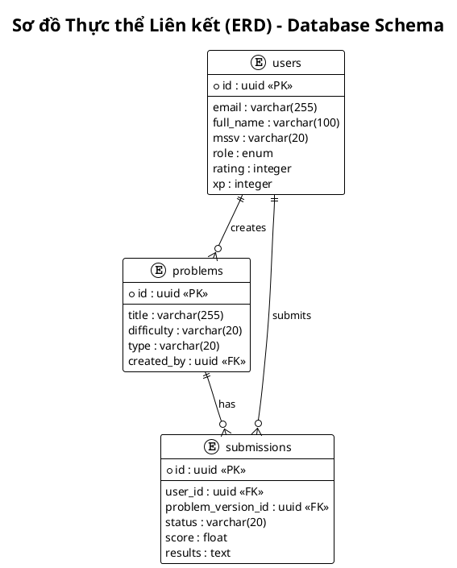
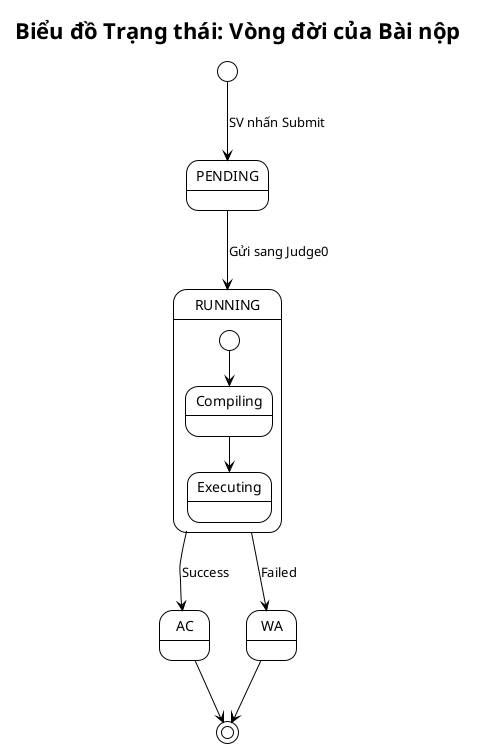
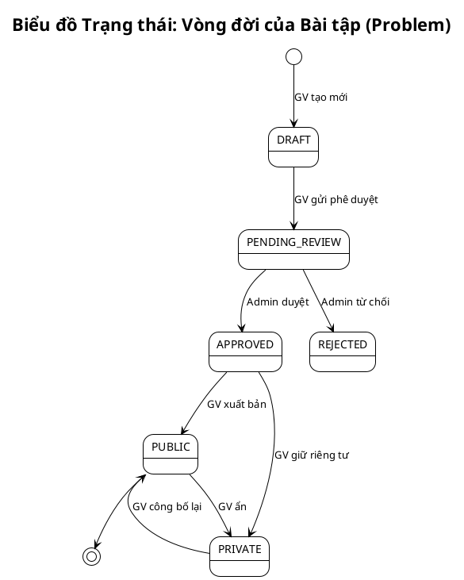
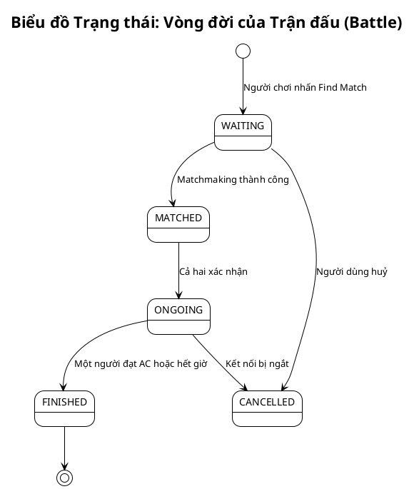
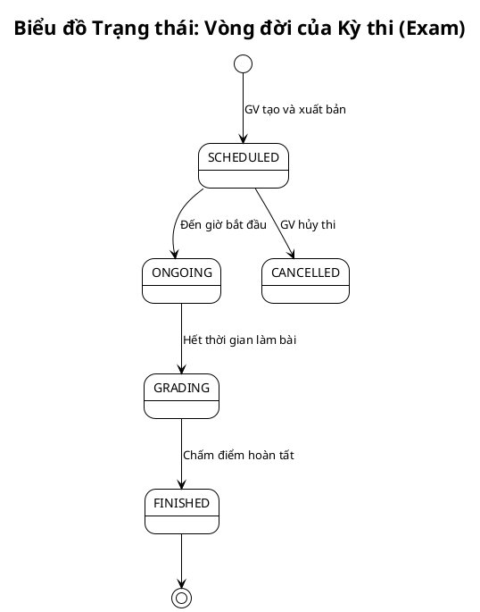
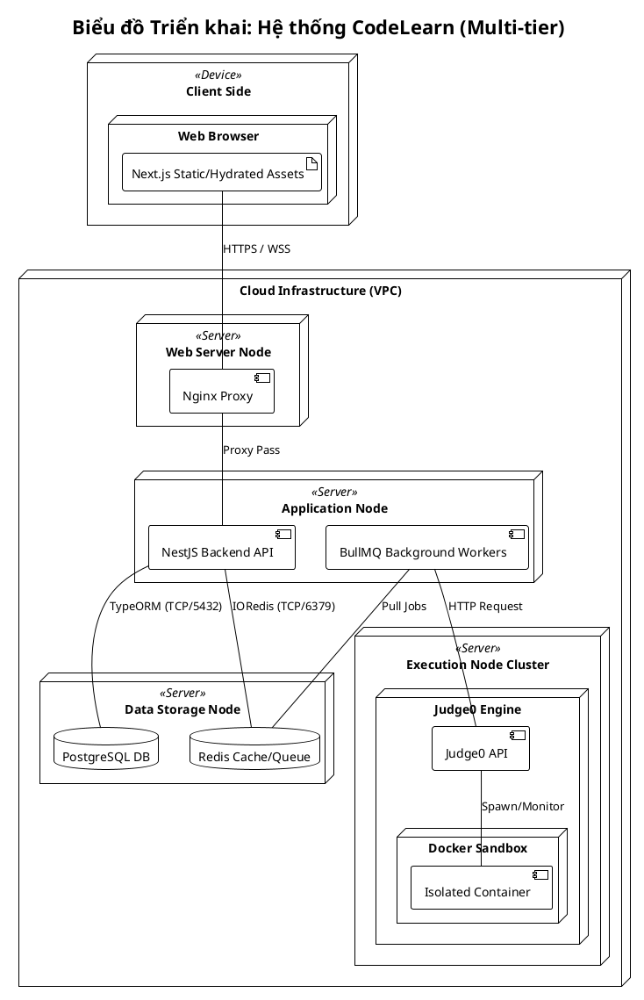

## 3.6. Biểu đồ lớp và ERD

### 3.6.1. Biểu đồ lớp phân hệ người dùng và lộ trình học
**Hình 3.24. Biểu đồ lớp phân hệ người dùng và lộ trình học**

### 3.6.2. Biểu đồ lớp phân hệ bài tập và quản lý phiên bản
**Hình 3.25. Biểu đồ lớp phân hệ bài tập và quản lý phiên bản**

### 3.6.3. Biểu đồ lớp phân hệ nộp bài và kết quả chấm
**Hình 3.26. Biểu đồ lớp phân hệ nộp bài và kết quả chấm**

### 3.6.4. Biểu đồ lớp tổng thể hệ thống CodeLearn
**Hình 3.27. Biểu đồ lớp tổng thể hệ thống CodeLearn**

### 3.6.5. Sơ đồ thực thể liên kết cơ sở dữ liệu
**Hình 3.28. Sơ đồ thực thể liên kết cơ sở dữ liệu**

---

## 3.7. Biểu đồ trạng thái

### 3.7.1. Biểu đồ trạng thái vòng đời bài nộp
**Hình 3.29. Biểu đồ trạng thái vòng đời bài nộp**

### 3.7.2. Biểu đồ trạng thái vòng đời bài tập
**Hình 3.30. Biểu đồ trạng thái vòng đời bài tập**

### 3.7.3. Biểu đồ trạng thái vòng đời trận đấu Code Battle
**Hình 3.31. Biểu đồ trạng thái vòng đời trận đấu Code Battle**

### 3.7.4. Biểu đồ trạng thái vòng đời kỳ thi
**Hình 3.32. Biểu đồ trạng thái vòng đời kỳ thi**

---

## 3.8. Biểu đồ triển khai

### 3.8.1. Biểu đồ triển khai hệ thống CodeLearn
**Hình 3.33. Biểu đồ triển khai hệ thống CodeLearn**

