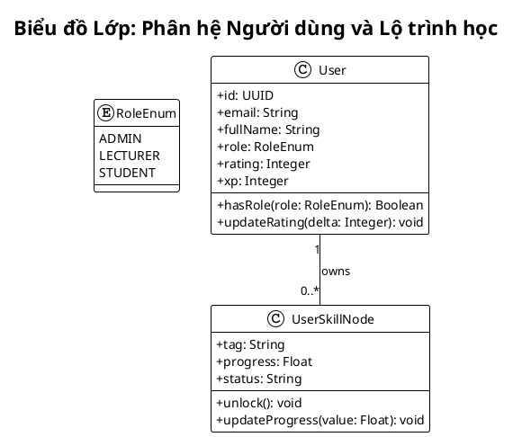
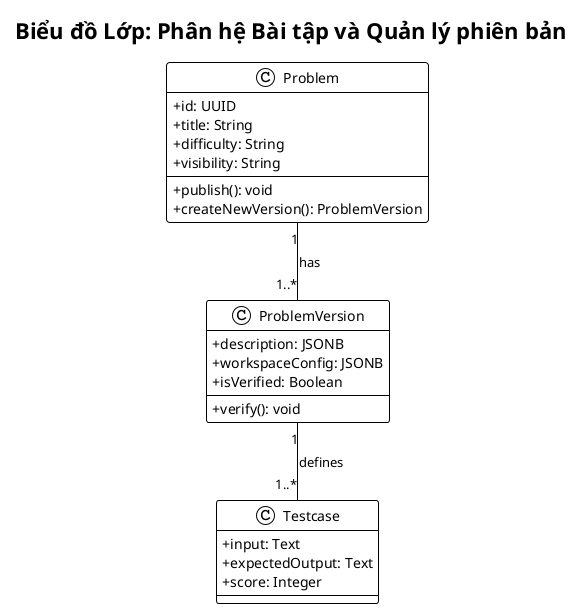
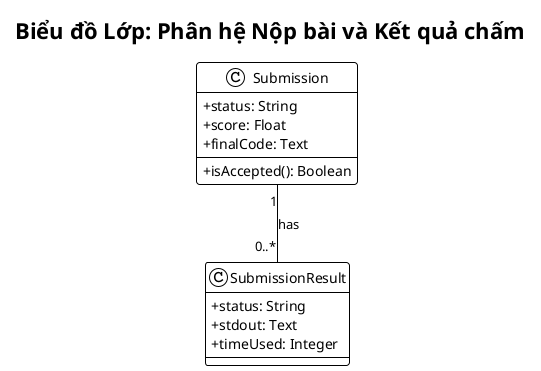
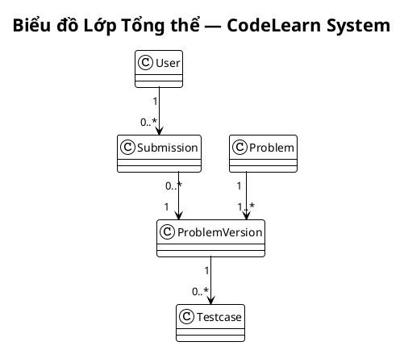
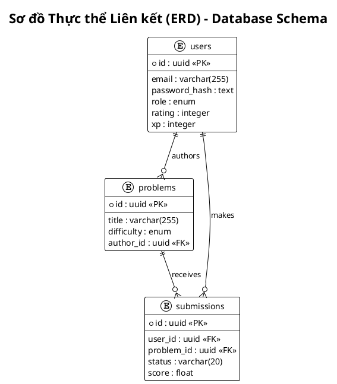
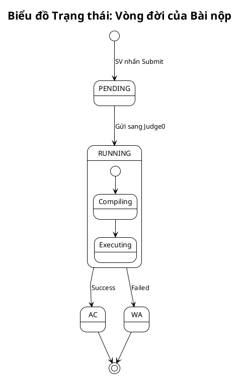
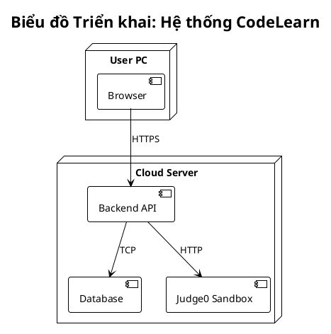

## 3.6. Biểu đồ lớp và ERD

### 3.6.1. Biểu đồ lớp phân hệ người dùng và lộ trình học
**Hình 3.49. Biểu đồ lớp phân hệ người dùng và lộ trình học**

### 3.6.2. Biểu đồ lớp phân hệ bài tập và quản lý phiên bản
**Hình 3.50. Biểu đồ lớp phân hệ bài tập và quản lý phiên bản**

### 3.6.3. Biểu đồ lớp phân hệ nộp bài và kết quả chấm
**Hình 3.51. Biểu đồ lớp phân hệ nộp bài và kết quả chấm**

### 3.6.4. Biểu đồ lớp tổng thể hệ thống CodeLearn
**Hình 3.52. Biểu đồ lớp tổng thể hệ thống CodeLearn**

### 3.6.5. Sơ đồ thực thể liên kết cơ sở dữ liệu
**Hình 3.53. Sơ đồ thực thể liên kết cơ sở dữ liệu**

---

## 3.7. Biểu đồ trạng thái

### 3.7.1. Biểu đồ trạng thái vòng đời bài nộp
**Hình 3.54. Biểu đồ trạng thái vòng đời bài nộp**

---

## 3.8. Biểu đồ triển khai

### 3.8.1. Biểu đồ triển khai hệ thống CodeLearn
**Hình 3.58. Biểu đồ triển khai hệ thống CodeLearn**

